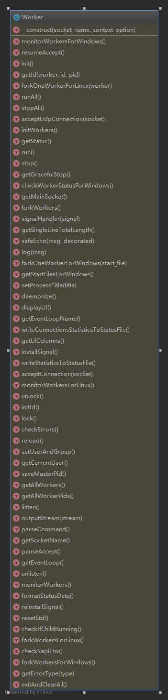

### 梳理一下  
Worker类成员图  
  

```php   
1、保存socket_name【ip和端口】称为socket_name【php叫法】  
   创建一个上下文选项参数
public function __construct($socket_name = '', $context_option = array())
    {
        // Save all worker instances.
        $this->workerId                    = spl_object_hash($this);
        static::$_workers[$this->workerId] = $this;
        static::$_pidMap[$this->workerId]  = array();

        // Get autoload root path.
        $backtrace                = debug_backtrace();
        $this->_autoloadRootPath = dirname($backtrace[0]['file']);

        // Context for socket.
        if ($socket_name) {
            $this->_socketName = $socket_name;
            if (!isset($context_option['socket']['backlog'])) {
            //设置低层tcp/udp内核接受队列长度【设置过小的话，超出的客户端连接将不会接收】
                $context_option['socket']['backlog'] = static::DEFAULT_BACKLOG;
            }
            //配置上下文选项【影响低层socket套接字】
            $this->_context = stream_context_create($context_option);
        }
}  
2、检查运行环境   
protected static function checkSapiEnv()
      {
          // Only for cli.
          if (php_sapi_name() != "cli") {
              exit("only run in command line mode \n");
          }
          if (DIRECTORY_SEPARATOR === '\\') {
              self::$_OS = OS_TYPE_WINDOWS;
          }
} 
3、初始化  
protected static function init()
    {
        //配置程序运行出错回调函数
        set_error_handler(function($code, $msg, $file, $line){
            Worker::safeEcho("$msg in file $file on line $line\n");
        });

        //保存启动的文件名称
        $backtrace        = debug_backtrace();
        static::$_startFile = $backtrace[count($backtrace) - 1]['file'];

        //将启动文件名称替换为_线
        $unique_prefix = str_replace('/', '_', static::$_startFile);

        //创建pid文件名称
        if (empty(static::$pidFile)) {
            static::$pidFile = __DIR__ . "/../$unique_prefix.pid";
        }

        //创建日志文件
        if (empty(static::$logFile)) {
            static::$logFile = __DIR__ . '/../workerman.log';
        }
        //创建日志文件并给定权限
        $log_file = (string)static::$logFile;
        if (!is_file($log_file)) {
            touch($log_file);
            chmod($log_file, 0622);
        }

        //设置当前进程运行状态为1
        static::$_status = static::STATUS_STARTING;

        // 静态化存储启动时间
        static::$_globalStatistics['start_timestamp'] = time();
        //静态化存储临时文件路径
        static::$_statisticsFile                      = sys_get_temp_dir() . "/$unique_prefix.status";

        // Process title.
        //设置当前进程的名称
        static::setProcessTitle('WorkerMan: master process  start_file=' . static::$_startFile);

        // Init data for worker id.
        static::initId();

        // Timer init.
        Timer::init();
    }  
    
3.1 
protected static function initId()
    {
    //worker实例个数
        foreach (static::$_workers as $worker_id => $worker) {
            $new_id_map = array();
            //每个worker实例的进程数
            $worker->count = $worker->count <= 0 ? 1 : $worker->count;
            //给每个worker实例初始化，初始化个数由count决定 
            for($key = 0; $key < $worker->count; $key++) {
                $new_id_map[$key] = isset(static::$_idMap[$worker_id][$key]) ? static::$_idMap[$worker_id][$key] : 0;
            }
            static::$_idMap[$worker_id] = $new_id_map;
        }
    }   
    
3.2定义器中断处理函数设置初始化  
public static function init($event = null)
    {
        if ($event) {
            self::$_event = $event;
        } else {
        //pcntl php中断信号扩展函数 
        //在此设置闹钟信号中断处理函数
        //中断信号处理函数为：\Workerman\Lib\Timer类成员signalHandle方法
        //启动程序后如果产生此中断信号此类的成员方法将被调用
            if (function_exists('pcntl_signal')) {
                pcntl_signal(SIGALRM, array('\Workerman\Lib\Timer', 'signalHandle'), false);
            }
        }
    }  
    
4.锁定文件【防止二次启动-在已启动情况下】
protected static function lock()
    {
        //打开启动文件并锁定
        //LOCK_EX此参数表示 如果运行此文件将被锁定
        $fd = fopen(static::$_startFile, 'r');
        if (!$fd || !flock($fd, LOCK_EX)) {
            static::log("Workerman[".static::$_startFile."] already running");
            exit;
        }
    } 
    
5.
protected static function parseCommand()
    {
        //非linux直接返回
        if (static::$_OS !== OS_TYPE_LINUX) {
            return;
        }
        //shell终端输入的参数$argv
        global $argv;
        // Check argv;
        //第一个参数启动文件名称
        $start_file = $argv[0];
        //可操作的命令
        $available_commands = array(
            'start',
            'stop',
            'restart',
            'reload',
            'status',
            'connections',
        );
        $usage = "Usage: php yourfile <command> [mode]\nCommands: \nstart\t\tStart worker in DEBUG mode.\n\t\tUse mode -d to start in DAEMON mode.\nstop\t\tStop worker.\n\t\tUse mode -g to stop gracefully.\nrestart\t\tRestart workers.\n\t\tUse mode -d to start in DAEMON mode.\n\t\tUse mode -g to stop gracefully.\nreload\t\tReload codes.\n\t\tUse mode -g to reload gracefully.\nstatus\t\tGet worker status.\n\t\tUse mode -d to show live status.\nconnections\tGet worker connections.\n";
        //命令不在指定命令数组中退出整个进程
        if (!isset($argv[1]) || !in_array($argv[1], $available_commands)) {
            if (isset($argv[1])) {
                static::safeEcho('Unknown command: ' . $argv[1] . "\n");
            }
            exit($usage);
        }

        // 获取命令和命令的相关选项
        $command  = trim($argv[1]);
        $command2 = isset($argv[2]) ? $argv[2] : '';

        // 启动命令
        $mode = '';
        if ($command === 'start') {
        //是否以守护进程方式运行
            if ($command2 === '-d' || static::$daemonize) {
                $mode = 'in DAEMON mode';
            } else {
                $mode = 'in DEBUG mode';
            }
        }
        //将内容写入日志并打印到终端中【非守护进程才打印】
        static::log("Workerman[$start_file] $command $mode");

        // 获取master_pid文件
        $master_pid      = is_file(static::$pidFile) ? file_get_contents(static::$pidFile) : 0;
        echo "master_pid:".$master_pid.PHP_EOL;
        //从master_pid读取到的主进程是否存在
        //且当前进程号与读取的主进程号不一致说明已经启动
        $master_is_alive = $master_pid && posix_kill($master_pid, 0) && posix_getpid() != $master_pid;
        // Master is still alive?
        echo "master_pid1:".$master_pid.PHP_EOL;
        if ($master_is_alive) {
            if ($command === 'start') {
                static::log("Workerman[$start_file] already running");
                exit;
            }
        } elseif ($command !== 'start' && $command !== 'restart') {
            static::log("Workerman[$start_file] not run");
            exit;
        }

        // 执行命令
        switch ($command) {
            case 'start':
                if ($command2 === '-d') {
                    static::$daemonize = true;
                }
                break;
            case 'status':
                while (1) {
                    //删除全局静态文件
                    if (is_file(static::$_statisticsFile)) {
                        @unlink(static::$_statisticsFile);
                    }
                    // Master process will send SIGUSR2 signal to all child processes.
                    //向主进程发送SIGUSR2自定义中断信号
                    posix_kill($master_pid, SIGUSR2);
                    // Sleep 1 second.
                    //等待1秒钟让中断处理函数运行
                    sleep(1);
                    // Clear terminal.
                    if ($command2 === '-d') {
                        static::safeEcho("\33[H\33[2J\33(B\33[m", true);
                    }
                    // 在终端中打印进程状态
                    static::safeEcho(static::formatStatusData());
                    if ($command2 !== '-d') {
                        exit(0);
                    }
                    static::safeEcho("\nPress Ctrl+C to quit.\n\n");
                }
                exit(0);
            case 'connections':
                if (is_file(static::$_statisticsFile) && is_writable(static::$_statisticsFile)) {
                    unlink(static::$_statisticsFile);
                }
                // Master process will send SIGIO signal to all child processes.
                posix_kill($master_pid, SIGIO);
                // Waiting amoment.
                usleep(500000);
                // Display statisitcs data from a disk file.
                if(is_readable(static::$_statisticsFile)) {
                    readfile(static::$_statisticsFile);
                }
                exit(0);
            case 'restart':
            case 'stop':
                if ($command2 === '-g') {
                    static::$_gracefulStop = true;
                    $sig = SIGTERM;
                    static::log("Workerman[$start_file] is gracefully stopping ...");
                } else {
                    static::$_gracefulStop = false;
                    $sig = SIGINT;
                    static::log("Workerman[$start_file] is stopping ...");
                }
                // Send stop signal to master process.
                $master_pid && posix_kill($master_pid, $sig);
                // Timeout.
                $timeout    = 5;
                $start_time = time();
                // Check master process is still alive?
                while (1) {
                    $master_is_alive = $master_pid && posix_kill($master_pid, 0);
                    if ($master_is_alive) {
                        // Timeout?
                        if (!static::$_gracefulStop && time() - $start_time >= $timeout) {
                            static::log("Workerman[$start_file] stop fail");
                            exit;
                        }
                        // Waiting amoment.
                        usleep(10000);
                        continue;
                    }
                    // Stop success.
                    static::log("Workerman[$start_file] stop success");
                    if ($command === 'stop') {
                        exit(0);
                    }
                    if ($command2 === '-d') {
                        static::$daemonize = true;
                    }
                    break;
                }
                break;
            case 'reload':
                if($command2 === '-g'){
                    $sig = SIGQUIT;
                }else{
                    $sig = SIGUSR1;
                }
                posix_kill($master_pid, $sig);
                exit;
            default :
                if (isset($command)) {
                    static::safeEcho('Unknown command: ' . $command . "\n");
                }
                exit($usage);
        }
    }  
    
6.日志打印说明  
public static function log($msg)
    {
    //不是以守护进程方式启动的默认把数据打印到终端
        $msg = $msg . "\n";
        if (!static::$daemonize) {
            static::safeEcho($msg);
        }
        //将数据写入初始化好的日志文件中
        file_put_contents((string)static::$logFile, date('Y-m-d H:i:s') . ' ' . 'pid:'
            . (static::$_OS === OS_TYPE_LINUX ? posix_getpid() : 1) . ' ' . $msg, FILE_APPEND | LOCK_EX);
    }
    
6.1
public static function safeEcho($msg, $decorated = false)
    {
        $stream = static::outputStream();
        if (!$stream) {
            return false;
        }
        if (!$decorated) {
        //设置终端字体颜色
            $line = $white = $green = $end = '';
            if (static::$_outputDecorated) {
                $line = "\033[1A\n\033[K";
                $white = "\033[47;30m";
                $green = "\033[32;40m";
                $end = "\033[0m";
            }
            
            $msg = str_replace(array('<n>', '<w>', '<g>'), array($line, $white, $green), $msg);
            $msg = str_replace(array('</n>', '</w>', '</g>'), $end, $msg);
        } elseif (!static::$_outputDecorated) {
            return false;
        }
        //将数据写入终端并冲刷流缓冲区全部输出
        fwrite($stream, $msg);
        fflush($stream);
        return true;
    }
    
6.2 获取输出终端文件描述符【流】
private static function outputStream($stream = null)
    {
        //获取标准输出终端
        if (!$stream) {
            $stream = static::$_outputStream ? static::$_outputStream : STDOUT;
        }
        if (!$stream || !is_resource($stream) || 'stream' !== get_resource_type($stream)) {
            return false;
        }
        //获取文件的相关属性
        $stat = fstat($stream);
        //通过掩码计算是否是常规文件
        if (($stat['mode'] & 0170000) === 0100000) {
            // file
            static::$_outputDecorated = false;
        } else {
        //检测是否是终端文件STOUT 默认映射的就是终端
            static::$_outputDecorated =
                static::$_OS === OS_TYPE_LINUX &&
                function_exists('posix_isatty') &&
                posix_isatty($stream);
        }
        return static::$_outputStream = $stream;
    }  
    
7. 创建守护进程  
protected static function daemonize()
    {
        //环境检查和运行方式检测
        if (!static::$daemonize || static::$_OS !== OS_TYPE_LINUX) {
            return;
        }
        //权限掩码屏蔽0时你在终端通过touch vim 等或是php file_put_contents fopen等方式
        //创建的文件权限将会是777
        umask(0);
        //fork 创建1个进程，此进程和父进程将拥有同样的代码
        //子进程和父进程将能访问前面所有运行的代码和访问数据
        $pid = pcntl_fork();
        //子进程的第一行语句在此运行，直到遇到exit或是retrun为子进程终止
        //进程创建失败时
        if (-1 === $pid) {
            throw new Exception('fork fail');
        } elseif ($pid > 0) {
        //父进程退出
            exit(0);
        }
        //子进程创建一个会话，同时该子进程将是进程组的组长进程以及会话首进程
        //getgpid getpgrp getsid 将是它自己
        if (-1 === posix_setsid()) {
            throw new Exception("setsid fail");
        }
        // Fork again avoid SVR4 system regain the control of terminal.
        //组长进程创建一个子进程
        //该父进程退出，自此会话中存在一个进程，该进程将不会受控制终端影响
        $pid = pcntl_fork();
        if (-1 === $pid) {
            throw new Exception("fork fail");
        } elseif (0 !== $pid) {
            exit(0);
        }
    }  
    
    
8.初始化worker给worker实例设置名称和进程运行的用户id以及相关成员初始化
protected static function initWorkers()
    {
        if (static::$_OS !== OS_TYPE_LINUX) {
            return;
        }
        //worker实例个数【假设一个】
        foreach (static::$_workers as $worker) {
            // Worker name.
            //woker实例名称
            if (empty($worker->name)) {
                $worker->name = 'none';
            }

            // Get unix user of the worker process.
            //获取当前进程运行的用户get_uid()
            if (empty($worker->user)) {
                $worker->user = static::getCurrentUser();
            } else {
                if (posix_getuid() !== 0 && $worker->user != static::getCurrentUser()) {
                    static::log('Warning: You must have the root privileges to change uid and gid.');
                }
            }

            // 获取前面初始化时填写的socket[ip:port]
            $worker->socket = $worker->getSocketName();

            // Status name.
            $worker->status = '<g> [OK] </g>';

            // Get column mapping for UI
            /**
            $column_map = [
                        'proto'     =>  'transport',
                        'user'      =>  'user',
                        'worker'    =>  'name',
                        'socket'    =>  'socket',
                        'processes' =>  'count',
                        'status'    =>  'status',
                    ];
            **/
            foreach(static::getUiColumns() as $column_name => $prop){
            
                //检测该类是否存在指定成员
                !isset($worker->{$prop}) && $worker->{$prop}= 'NNNN';
                //长度
                $prop_length = strlen($worker->{$prop});
                //转换为key
                $key = '_max' . ucfirst(strtolower($column_name)) . 'NameLength';
                //给成员初始化值
                static::$$key = max(static::$$key, $prop_length);
            }

            // Listen.
            if (!$worker->reusePort) {
                $worker->listen();
            }
        }
    }  
    
9.主进程启动服务并监听socket
public function listen()
      {
      //未设置socketname[ip:port]时
          if (!$this->_socketName) {
              return;
          }
  
          // 框架自己的加载类器
          Autoloader::setRootPath($this->_autoloadRootPath);
  
          if (!$this->_mainSocket) {
              //获取协议和socket地址
              //socket地址【ip,port,family类】这里仅ip,port
              
              list($scheme, $address) = explode(':', $this->_socketName, 2);
              
              /**
              protected static $_builtinTransports = [
                      'tcp'   => 'tcp',
                      'udp'   => 'udp',
                      'unix'  => 'unix',
                      'ssl'   => 'tcp'
                  ];
              **/
              //如果你要是http[或是text,ws,websocket]此句正好满足条件，不然运行else
              if (!isset(static::$_builtinTransports[$scheme])) {
                  //如果是http://xxx给的参数就会得到workerman/protocols/Http.php文件
                  $scheme         = ucfirst($scheme);
                  //应用层协议
                  $this->protocol = substr($scheme,0,1)==='\\' ? $scheme : '\\Protocols\\' . $scheme;
                  //检测类文件是否存在
                  if (!class_exists($this->protocol)) {
                      $this->protocol = "\\Workerman\\Protocols\\$scheme";
                      if (!class_exists($this->protocol)) {
                          throw new Exception("class \\Protocols\\$scheme not exist");
                      }
                  }
  
                  if (!isset(static::$_builtinTransports[$this->transport])) {
                      throw new \Exception('Bad worker->transport ' . var_export($this->transport, true));
                  }
              } else {
                  //常规的传输层协议
                  $this->transport = $scheme;
              }
  
              //默认就是tcp传输层协议拼装为tcp://ip:port
              $local_socket = static::$_builtinTransports[$this->transport] . ":" . $address;
               
               //stream_socket_server的标志位参数
              // Flag.
              $flags = $this->transport === 'udp' ? STREAM_SERVER_BIND : STREAM_SERVER_BIND | STREAM_SERVER_LISTEN;
              $errno = 0;
              $errmsg = '';
              //是否启用reuseport 启用了之后调用setsocketopt函数
              //这样保证该端口还未释放再重启时能立马使用，而不是报端口已占用的情况
              // SO_REUSEPORT.
              if ($this->reusePort) {
                  stream_context_set_option($this->_context, 'socket', 'so_reuseport', 1);
              }
  
              //创建socket 套接字，此时在该进程在生成一个文件描述符并关联相应的结点node
              $this->_mainSocket = stream_socket_server($local_socket, $errno, $errmsg, $flags, $this->_context);
              if (!$this->_mainSocket) {
                  throw new Exception($errmsg);
              }
              
              //是否启用了加密传输协议或是unix本地域协议
              //unix本地域一般用于进程间IPC通信比较多，当然用于本机互相通知也是可以的
              if ($this->transport === 'ssl') {
                  stream_socket_enable_crypto($this->_mainSocket, false);
              } elseif ($this->transport === 'unix') {
                  $socketFile = substr($address, 2);
                  if ($this->user) {
                      chown($socketFile, $this->user);
                  }
                  if ($this->group) {
                      chgrp($socketFile, $this->group);
                  }
              }
  
              // Try to open keepalive for tcp and disable Nagle algorithm.
              if (function_exists('socket_import_stream') && static::$_builtinTransports[$this->transport] === 'tcp') {
                  set_error_handler(function(){});
                  
                  //启用压缩为socket资源同时设置KEEPALIVE，tcp_nodelay功能
                  $socket = socket_import_stream($this->_mainSocket);
                  socket_set_option($socket, SOL_SOCKET, SO_KEEPALIVE, 1);
                  socket_set_option($socket, SOL_TCP, TCP_NODELAY, 1);
                  restore_error_handler();
              }
  
              // Non blocking.
              //设置socket 为非阻塞I/O
              //需要程序忙轮询不断的问有没有数据
              stream_set_blocking($this->_mainSocket, 0);
          }
  
          $this->resumeAccept();
      }


    
11、主进程设置中断信号处理函数，可接收外中断信号
protected static function installSignal()
    {
        if (static::$_OS !== OS_TYPE_LINUX) {
            return;
        }
        // stop
        pcntl_signal(SIGINT, array('\Workerman\Worker', 'signalHandler'), false);
        // graceful stop
        pcntl_signal(SIGTERM, array('\Workerman\Worker', 'signalHandler'), false);
        // reload
        pcntl_signal(SIGUSR1, array('\Workerman\Worker', 'signalHandler'), false);
        // graceful reload
        pcntl_signal(SIGQUIT, array('\Workerman\Worker', 'signalHandler'), false);
        // status
        pcntl_signal(SIGUSR2, array('\Workerman\Worker', 'signalHandler'), false);
        // connection status
        pcntl_signal(SIGIO, array('\Workerman\Worker', 'signalHandler'), false);
        // ignore
        pcntl_signal(SIGPIPE, SIG_IGN, false);
    }
    
12.将主进程号存储在文件中
protected static function saveMasterPid()
    {
        if (static::$_OS !== OS_TYPE_LINUX) {
            return;
        }

        static::$_masterPid = posix_getpid();
        if (false === file_put_contents(static::$pidFile, static::$_masterPid)) {
            throw new Exception('can not save pid to ' . static::$pidFile);
        }
    }
    
13.解锁 
protected static function unlock()
    {
        //解锁
        $fd = fopen(static::$_startFile, 'r');
        $fd && flock($fd, LOCK_UN);
    }
    
    
14.终端显示进程运行信息  
protected static function displayUI()  

15.fork Worker创建多进程
protected static function forkWorkers()
    {
        if (static::$_OS === OS_TYPE_LINUX) {
            static::forkWorkersForLinux();
        } else {
            static::forkWorkersForWindows();
        }
    } 
    
16.linux进程创建
protected static function forkWorkersForLinux()
    {

        //worker实例个数
        //总进程数：worker实例化次数*指定的进程数
        foreach (static::$_workers as $worker) {
            //检测状态
            if (static::$_status === static::STATUS_STARTING) {
                if (empty($worker->name)) {
                    $worker->name = $worker->getSocketName();
                }
                $worker_name_length = strlen($worker->name);
                if (static::$_maxWorkerNameLength < $worker_name_length) {
                    static::$_maxWorkerNameLength = $worker_name_length;
                }
            }
            //每个worker实例的进程数
            while (count(static::$_pidMap[$worker->workerId]) < $worker->count) {
                static::forkOneWorkerForLinux($worker);
            }
        }
    }
    
17、创建工作进程
protected static function forkOneWorkerForLinux($worker)
    {
        // Get available worker id.
        $id = static::getId($worker->workerId, 0);
        if ($id === false) {
            return;
        }
        //创建一个进程
        $pid = pcntl_fork();
        //主进程
        if ($pid > 0) {
        //存储每个worker实例创建的进程号
        //static::$_pidMap[$worker->workerId][进程号] = 进程号
            static::$_pidMap[$worker->workerId][$pid] = $pid;
            static::$_idMap[$worker->workerId][$id]   = $pid;
        } // For child processes.
        elseif (0 === $pid) {
        //子进程
        //随机因子初始化
        //子进程的第一行语句在此运行，前面的代码跟子进程没半毛钱关系
            srand();
            mt_srand();
            
            //reuusePort时各个子进程各个监听自己的socket
            //要么主进程负责监听socket,子进程负责连接socket
            //要么主进程负责监听socket和连接socket
            //具体看作者的设计网络框架的并发模式和事件处理模式
            if ($worker->reusePort) {
                $worker->listen();
            }
            if (static::$_status === static::STATUS_STARTING) {
                static::resetStd();
            }
            static::$_pidMap  = array();
            // Remove other listener.
            //关闭其它的监听socket
            foreach(static::$_workers as $key => $one_worker) {
                if ($one_worker->workerId !== $worker->workerId) {
                    $one_worker->unlisten();
                    unset(static::$_workers[$key]);
                }
            }
            //清空定时器
            Timer::delAll();
            static::setProcessTitle('WorkerMan: worker process  ' . $worker->name . ' ' . $worker->getSocketName());
            //将当前进程设置为当前进程组的成员以及运行用户设置为用户组成员
            $worker->setUserAndGroup();
            $worker->id = $id;
            //工作进程运行
            $worker->run();
            $err = new Exception('event-loop exited');
            static::log($err);
            exit(250);
            //子进程的最后一行语句，超出此范围的为父进程运行
        } else {
            throw new Exception("forkOneWorker fail");
        }
    }
    
10.1 清空定时器
public static function delAll()
    {
        self::$_tasks = array();
        pcntl_alarm(0);
        if (self::$_event) {
            self::$_event->clearAllTimer();
        }
    }
    
10.2 设置当前进程为当前进程组的成员|设置当前运行用户为当前用户组成员
public function setUserAndGroup()
    {
        // Get uid.
        $user_info = posix_getpwnam($this->user);
        if (!$user_info) {
            static::log("Warning: User {$this->user} not exsits");
            return;
        }
        $uid = $user_info['uid'];
        // Get gid.
        if ($this->group) {
            $group_info = posix_getgrnam($this->group);
            if (!$group_info) {
                static::log("Warning: Group {$this->group} not exsits");
                return;
            }
            $gid = $group_info['gid'];
        } else {
            $gid = $user_info['gid'];
        }

        // Set uid and gid.
        if ($uid != posix_getuid() || $gid != posix_getgid()) {
        //设置当前进程的组进程和组用户
            if (!posix_setgid($gid) || !posix_initgroups($user_info['name'], $gid) || !posix_setuid($uid)) {
                static::log("Warning: change gid or uid fail.");
            }
        }
    }
    
11.工作[子]进程run
public function run()
    {
        //修改子进程的运行状态
        static::$_status = static::STATUS_RUNNING;

        //设置子进程的shutdown回调
        register_shutdown_function(array("\\Workerman\\Worker", 'checkErrors'));

        // 
        Autoloader::setRootPath($this->_autoloadRootPath);

        // 是否未配置全局事件循环对象
        if (!static::$globalEvent) {
            $event_loop_class = static::getEventLoopName();
            //实例化事件循环类[reactor]
            static::$globalEvent = new $event_loop_class;
            //将监听socket 事件处理器添加到reactor中
            $this->resumeAccept();
        }

        // Reinstall signal.
        //子进程安装自己的中断信号处理器【跟其它进程没毛线关系】
        static::reinstallSignal();

        // Init Timer.
        //子进程设置定时中断
        Timer::init(static::$globalEvent);

        // 设置子进程的初始回调
        if (empty($this->onMessage)) {
            $this->onMessage = function () {};
        }

        restore_error_handler();
        
        // 子进程启动时尝试运行workerStart回调
        if ($this->onWorkerStart) {
            try {
                call_user_func($this->onWorkerStart, $this);
            } catch (\Exception $e) {
                static::log($e);
                // Avoid rapid infinite loop exit.
                sleep(1);
                exit(250);//出错立马退出当前进程
            } catch (\Error $e) {
                static::log($e);
                // Avoid rapid infinite loop exit.
                sleep(1);
                exit(250);
            }
        }

        // 事件循环
        static::$globalEvent->loop();
    }

11.1 获取事件循环扩展类
protected static function getEventLoopName()
    {
        if (static::$eventLoopClass) {
            return static::$eventLoopClass;
        }

        //swoole\event事件扩展【不考虑】
        if (!class_exists('\Swoole\Event', false)) {
            unset(static::$_availableEventLoops['swoole']);
        }
        
        /**
        protected static $_availableEventLoops = array(
                'libevent' => '\Workerman\Events\Libevent',//libevent扩展
                'event'    => '\Workerman\Events\Event'//event扩展 可以查看本人github上的资料
                // Temporarily removed swoole because it is not stable enough  
                //'swoole'   => '\Workerman\Events\Swoole'
            );
        **/
        $loop_name = '';
        //检测用户否安装了libevent和event扩展
        //有兴趣可以观看本人在laravel社区或是github上对libevent框架内核源码的注解【需要c语言知识】
        foreach (static::$_availableEventLoops as $name=>$class) {
            if (extension_loaded($name)) {
                $loop_name = $name;
                break;
            }
        }

        //如果安装了以上扩展的话
        if ($loop_name) {
            if (interface_exists('\React\EventLoop\LoopInterface')) {
                switch ($loop_name) {
                    case 'libevent':
                        static::$eventLoopClass = '\Workerman\Events\React\ExtLibEventLoop';
                        break;
                    case 'event':
                        static::$eventLoopClass = '\Workerman\Events\React\ExtEventLoop';
                        break;
                    default :
                        static::$eventLoopClass = '\Workerman\Events\React\StreamSelectLoop';
                        break;
                }
            } else {
                static::$eventLoopClass = static::$_availableEventLoops[$loop_name];
            }
        } else {
        //2选1要么Stream,要么Select
            static::$eventLoopClass = interface_exists('\React\EventLoop\LoopInterface')? '\Workerman\Events\React\StreamSelectLoop':'\Workerman\Events\Select';
        }
        return static::$eventLoopClass;
    }
11.2.将socket I/O事件处理器注册到reactor中的I/O事件处理器池中【I/O事件映射】
 public function resumeAccept()
    {
        //事件循环对象
        //在此假设为SELECT IO复用函数
        //后面会说到Event 扩展
        if (static::$globalEvent && true === $this->_pauseAccept && $this->_mainSocket) {
            if ($this->transport !== 'udp') {
                //将监听socket I/O事件处理器注册到reactor中的I/O事件处理器池中
                static::$globalEvent->add($this->_mainSocket, EventInterface::EV_READ, array($this, 'acceptConnection'));
            } else {
                static::$globalEvent->add($this->_mainSocket, EventInterface::EV_READ, array($this, 'acceptUdpConnection'));
            }
            $this->_pauseAccept = false;
        }
    }
11.2.1 Select事件多路复用选择器 初始化 
public function __construct()
    {
        //创建socket_pair双工流管道用于进程间IPC通信
        $this->channel = stream_socket_pair(DIRECTORY_SEPARATOR === '/' ? STREAM_PF_UNIX : STREAM_PF_INET,
            STREAM_SOCK_STREAM, STREAM_IPPROTO_IP);
        if($this->channel) {
        //设置读端为非阻塞模式
            stream_set_blocking($this->channel[0], 0);
            //将此socket读端存入读文件描述符集合中，以便select 轮询等待就绪事件的发生
            $this->_readFds[0] = $this->channel[0];
        }
        // 创建一个队列【与数据结构相关的函数】
        //有队头，队尾，一般从某一端插入数据，从某一端获取数据
        //插入数据时称进队，获取数据时称出队操作
        $this->_scheduler = new \SplPriorityQueue();
        $this->_scheduler->setExtractFlags(\SplPriorityQueue::EXTR_BOTH);
    }
    
11.3 Reactor Select IO复用 完成I/O 定时 信号事件处理器的注册
Select.php
//fd 文件描述符
//读写异常事件标志位
//事件的回调函数
//回调函数的参数
public function add($fd, $flag, $func, $args = array())
    {
        switch ($flag) {
        //配置读写事件标志时
            case self::EV_READ:
            case self::EV_WRITE:
                //获取读文件描述符集合或是写文件描述符集合个数
                $count = $flag === self::EV_READ ? count($this->_readFds) : count($this->_writeFds);
                //超过1024个【因为SELECT限制每个进程只能打开1024个文件】
                if ($count >= 1024) {
                    echo "Warning: system call select exceeded the maximum number of connections 1024, please install event/libevent extension for more connections.\n";
                } else if (DIRECTORY_SEPARATOR !== '/' && $count >= 256) {
                    echo "Warning: system call select exceeded the maximum number of connections 256.\n";
                }
                //强制socketfd 转换为整数数值
                $fd_key                           = (int)$fd;
                //创建该fd的读或是写事件处理器
                //事件处理器概念：
                /**
                每个事件处理器一般都有
                fd文件描述符
                标志位
                事件：读写事件和异常事件简称为I/O事件处理器
                回调处理函数
                回调处理的参数
                ...
                **/
                //此时当前进程为Reactor 
                //allEvents 存储各个文件描述符【socket连接和监听socket都称为文件描述符】
                //对应的事件处理器
                $this->_allEvents[$fd_key][$flag] = array($func, $fd);
                //存储单独的读写文件描述符
                if ($flag === self::EV_READ) {
                    $this->_readFds[$fd_key] = $fd;
                } else {
                    $this->_writeFds[$fd_key] = $fd;
                }
                break;
            case self::EV_EXCEPT://异常事件处理器的注册
                $fd_key = (int)$fd;
                $this->_allEvents[$fd_key][$flag] = array($func, $fd);
                $this->_exceptFds[$fd_key] = $fd;
                break;
            case self::EV_SIGNAL://信号事件处理器
                // Windows not support signal.
                if(DIRECTORY_SEPARATOR !== '/') {
                    return false;
                }
                $fd_key                              = (int)$fd;
                $this->_signalEvents[$fd_key][$flag] = array($func, $fd);
                //如果是注册事件处理器的话该fd为信号数值
                //当相应的中断信号发生时运行此全局中断函数
                pcntl_signal($fd, array($this, 'signalHandler'));
                break;
            case self::EV_TIMER:
            case self::EV_TIMER_ONCE://定时事件处理器
            
                //定时器id增加值
                $timer_id = $this->_timerId++;
                //运行时间+fd
                $run_time = microtime(true) + $fd;
                //数据入队操作
                $this->_scheduler->insert($timer_id, -$run_time);
                //定时器id映射定时事件处理器
                $this->_eventTimer[$timer_id] = array($func, (array)$args, $flag, $fd);
                //设置超时时间
                $select_timeout = ($run_time - microtime(true)) * 1000000;
                if( $this->_selectTimeout > $select_timeout ){ 
                    $this->_selectTimeout = $select_timeout;   
                }  
                return $timer_id;
        }

        return true;
    } 
11.3.1 事件循环
public function loop()
    {
        while (1) {
            if(DIRECTORY_SEPARATOR === '/') {
                // 激活中断信号调度【只有php才有这骚用法】
                // 中断信号产生时会运行中断处理函数
                pcntl_signal_dispatch();
            }
            //读写异常文件描述符集合
            $read  = $this->_readFds;
            $write = $this->_writeFds;
            $except = $this->_exceptFds;

            // Waiting read/write/signal/timeout events.
            set_error_handler(function(){});
            //此时监听读写异常文件描述符集合中的文件是否有读写异常就绪事件发生
            //超时没有的话$ret返回0，如果有就绪事件发生【网卡接收到数据时就发生了针对socket】
            $ret = stream_select($read, $write, $except, 0, $this->_selectTimeout);
            restore_error_handler();

            //处理定时事件处理器
            if (!$this->_scheduler->isEmpty()) {
                $this->tick();
            }
            //如果没有就绪的I/O事件发生就会轮询【构成忙轮询，因为监听socket并没有设置为阻塞模式】
            //如果说监听socket 设置为阻塞模式了stream_select 会一直阻塞 程序会存在SLEEPING 状态】  
            if (!$ret) {
                continue;
            }

            //读文件描述符集合
            if ($read) {
            //循环得到就绪的文件描述符
                foreach ($read as $fd) {
                    $fd_key = (int)$fd;
                    //从reactor I/O事件处理器池从根据文件描述符和事件查找到前面注册好的I/O事件处理器
                    
                    if (isset($this->_allEvents[$fd_key][self::EV_READ])) {
                    //运行查找到的事件处理器的回调函数，并给回调函数传递参数
                    //第二个参数为文件描述符
                        call_user_func_array($this->_allEvents[$fd_key][self::EV_READ][0],
                            array($this->_allEvents[$fd_key][self::EV_READ][1]));
                    }
                }
            }

            if ($write) {
                foreach ($write as $fd) {
                    $fd_key = (int)$fd;
                    if (isset($this->_allEvents[$fd_key][self::EV_WRITE])) {
                        call_user_func_array($this->_allEvents[$fd_key][self::EV_WRITE][0],
                            array($this->_allEvents[$fd_key][self::EV_WRITE][1]));
                    }
                }
            }

            if($except) {
                foreach($except as $fd) {
                    $fd_key = (int) $fd;
                    if(isset($this->_allEvents[$fd_key][self::EV_EXCEPT])) {
                        call_user_func_array($this->_allEvents[$fd_key][self::EV_EXCEPT][0],
                            array($this->_allEvents[$fd_key][self::EV_EXCEPT][1]));
                    }
                }
            }
        }
    }
11.4 初始化定时器
public static function init($event = null)
    {
        
        if ($event) {
            self::$_event = $event;
        } else {
            if (function_exists('pcntl_signal')) {
                pcntl_signal(SIGALRM, array('\Workerman\Lib\Timer', 'signalHandle'), false);
            }
        }
    }
    
12. 监听socket 事件处理器运行时的回调函数
public function acceptConnection($socket)
    {
        //尝试接受客户端的连接，同时获取到客户端的ip地址
        set_error_handler(function(){});
        $new_socket = stream_socket_accept($socket, 0, $remote_address);
        restore_error_handler();

        //连接出错直接返回，事件循环再继续运行
        // Thundering herd.
        if (!$new_socket) {
            return;
        }

        // TcpConnection.
        //将连接socket 和此连接的地址构建一个TcpConnection对象
        $connection                         = new TcpConnection($new_socket, $remote_address);
        $this->connections[$connection->id] = $connection;
        $connection->worker                 = $this;
        $connection->protocol               = $this->protocol;
        $connection->transport              = $this->transport;
        $connection->onMessage              = $this->onMessage;
        $connection->onClose                = $this->onClose;
        $connection->onError                = $this->onError;
        $connection->onBufferDrain          = $this->onBufferDrain;
        $connection->onBufferFull           = $this->onBufferFull;

        // Try to emit onConnect callback.
        if ($this->onConnect) {
            try {
                call_user_func($this->onConnect, $connection);
            } catch (\Exception $e) {
                static::log($e);
                exit(250);
            } catch (\Error $e) {
                static::log($e);
                exit(250);
            }
        }
    }

12.1 客户端连接初始化
public function __construct($socket, $remote_address = '')
    {
           //当前进程客户端连接次数累加
        self::$statistics['connection_count']++;
        //当前进程id累加
        $this->id = $this->_id = self::$_idRecorder++;
        if(self::$_idRecorder === PHP_INT_MAX){
            self::$_idRecorder = 0;
        }
        //客户端连接socket 
        $this->_socket = $socket;
        //将客户端连接socket 设置为非阻塞I/O
        stream_set_blocking($this->_socket, 0);
        // Compatible with hhvm
        //尝试读取连接socket
        if (function_exists('stream_set_read_buffer')) {
            stream_set_read_buffer($this->_socket, 0);
        }
        //向reactor注册读事件处理器
        //当客户端有数据发送时此事件处理器将被运行
        Worker::$globalEvent->add($this->_socket, EventInterface::EV_READ, array($this, 'baseRead'));
        //此连接socket 的默认最大发送字节和最大发送包个数
        $this->maxSendBufferSize        = self::$defaultMaxSendBufferSize;
        $this->maxPackageSize           = self::$defaultMaxPackageSize;
        $this->_remoteAddress           = $remote_address;
        //此进程的连接对象
        static::$connections[$this->id] = $this;
    }
    
12.1 客户端读事件就绪时
public function baseRead($socket, $check_eof = true)
    {
        // SSL handshake.
        if ($this->transport === 'ssl' && $this->_sslHandshakeCompleted !== true) {
            if ($this->doSslHandshake($socket)) {
                $this->_sslHandshakeCompleted = true;
                if ($this->_sendBuffer) {
                    Worker::$globalEvent->add($socket, EventInterface::EV_WRITE, array($this, 'baseWrite'));
                }
            } else {
                return;
            }
        }

        //读取连接socket上的数据最大值为65535
        set_error_handler(function(){});
        $buffer = fread($socket, self::READ_BUFFER_SIZE);
        restore_error_handler();

        //未读取到连接socket的数据
        if ($buffer === '' || $buffer === false) {
        //关闭客户端连接  
            if ($check_eof && (feof($socket) || !is_resource($socket) || $buffer === false)) {
                $this->destroy();
                return;
            }
        } else {
        //读取的内容进行拼接
            $this->bytesRead += strlen($buffer);
            $this->_recvBuffer .= $buffer;
        }

        // If the application layer protocol has been set up.
        //如果配置了应用层协议如http/websocket/ws时
        //放后面解释，在此先解释传输层
        if ($this->protocol !== null) {
            //
            $parser = $this->protocol;
            
            while ($this->_recvBuffer !== '' && !$this->_isPaused) {
                // The current packet length is known.
                //刚开始数据包长度为0
                if ($this->_currentPackageLength) {
                    // Data is not enough for a package.
                    if ($this->_currentPackageLength > strlen($this->_recvBuffer)) {
                        break;
                    }
                } else {
                    // Get current package length.
                    set_error_handler(function($code, $msg, $file, $line){
                        Worker::safeEcho("$msg in file $file on line $line\n");
                    });
                    //得到数据的长度
                    $this->_currentPackageLength = $parser::input($this->_recvBuffer, $this);
                    restore_error_handler();
                    // The packet length is unknown.
                    if ($this->_currentPackageLength === 0) {
                        break;
                    } elseif ($this->_currentPackageLength > 0 && $this->_currentPackageLength <= $this->maxPackageSize) {
                        // Data is not enough for a package.
                        if ($this->_currentPackageLength > strlen($this->_recvBuffer)) {
                            break;
                        }
                    } // Wrong package.
                    else {
                        Worker::safeEcho('error package. package_length=' . var_export($this->_currentPackageLength, true));
                        $this->destroy();
                        return;
                    }
                }

                // The data is enough for a packet.
                self::$statistics['total_request']++;
                // The current packet length is equal to the length of the buffer.
                if (strlen($this->_recvBuffer) === $this->_currentPackageLength) {
                    $one_request_buffer = $this->_recvBuffer;
                    $this->_recvBuffer  = '';
                } else {
                    // Get a full package from the buffer.
                    $one_request_buffer = substr($this->_recvBuffer, 0, $this->_currentPackageLength);
                    // Remove the current package from the receive buffer.
                    $this->_recvBuffer = substr($this->_recvBuffer, $this->_currentPackageLength);
                }
                // Reset the current packet length to 0.
                $this->_currentPackageLength = 0;
                if (!$this->onMessage) {
                    continue;
                }
                try {
                    // Decode request buffer before Emitting onMessage callback.
                    call_user_func($this->onMessage, $this, $parser::decode($one_request_buffer, $this));
                } catch (\Exception $e) {
                    Worker::log($e);
                    exit(250);
                } catch (\Error $e) {
                    Worker::log($e);
                    exit(250);
                }
            }
            return;
        }

        //传输层协议直接运行onMessage完事
        if ($this->_recvBuffer === '' || $this->_isPaused) {
            return;
        }

        // Applications protocol is not set.
        //总连接数量累加
        self::$statistics['total_request']++;
        if (!$this->onMessage) {
            $this->_recvBuffer = '';
            return;
        }
        //尝试运行用户配置的onMessage回调函数
        try {
            call_user_func($this->onMessage, $this, $this->_recvBuffer);
        } catch (\Exception $e) {
            Worker::log($e);
            exit(250);
        } catch (\Error $e) {
            Worker::log($e);
            exit(250);
        }
        //运行完毕清空接受到的内容
        // Clean receive buffer.
        $this->_recvBuffer = '';
    }

12.1.1  
public function send($send_buffer, $raw = false)
    {
        if ($this->_status === self::STATUS_CLOSING || $this->_status === self::STATUS_CLOSED) {
            return false;
        }

        //使用应用层协议时再解释
        // Try to call protocol::encode($send_buffer) before sending.
        if (false === $raw && $this->protocol !== null) {
            $parser      = $this->protocol;
            $send_buffer = $parser::encode($send_buffer, $this);
            if ($send_buffer === '') {
                return null;
            }
        }

        //如果走ssl协议的话
        if ($this->_status !== self::STATUS_ESTABLISHED ||
            ($this->transport === 'ssl' && $this->_sslHandshakeCompleted !== true)
        ) {
       
            if ($this->_sendBuffer) {
            //检测发送内容是否超出
                if ($this->bufferIsFull()) {
                    self::$statistics['send_fail']++;
                    return false;
                }
            }
            //拼装发送缓冲数据
            $this->_sendBuffer .= $send_buffer;
            $this->checkBufferWillFull();
            return null;
        }

        // tcp协议首次为空缓冲
        if ($this->_sendBuffer === '') {
            if ($this->transport === 'ssl') {
                Worker::$globalEvent->add($this->_socket, EventInterface::EV_WRITE, array($this, 'baseWrite'));
                $this->_sendBuffer = $send_buffer;
                $this->checkBufferWillFull();
                return null;
            }
            //向连接socket写入数据 
            //测试tcp协议可以走到这里
            
            set_error_handler(function(){});
            $len = fwrite($this->_socket, $send_buffer);
            restore_error_handler();
            // send successful.
            //写入成功直接返回
            if ($len === strlen($send_buffer)) {
                $this->bytesWritten += $len;
                return true;
            }
            // Send only part of the data.
            if ($len > 0) {
                $this->_sendBuffer = substr($send_buffer, $len);
                $this->bytesWritten += $len;
            } else {
            //无法写入 客户端连接关闭时
                // Connection closed?
                if (!is_resource($this->_socket) || feof($this->_socket)) {
                    self::$statistics['send_fail']++;
                    if ($this->onError) {
                        try {
                            call_user_func($this->onError, $this, WORKERMAN_SEND_FAIL, 'client closed');
                        } catch (\Exception $e) {
                            Worker::log($e);
                            exit(250);
                        } catch (\Error $e) {
                            Worker::log($e);
                            exit(250);
                        }
                    }
                    $this->destroy();
                    return false;
                }
                $this->_sendBuffer = $send_buffer;
            }
            //如果只是写了一半，就会添加一个写事件处理器
            Worker::$globalEvent->add($this->_socket, EventInterface::EV_WRITE, array($this, 'baseWrite'));
            // Check if the send buffer will be full.
            $this->checkBufferWillFull();
            return null;
        } else {
            if ($this->bufferIsFull()) {
                self::$statistics['send_fail']++;
                return false;
            }

            $this->_sendBuffer .= $send_buffer;
            // Check if the send buffer is full.
            $this->checkBufferWillFull();
        }
    }
    
    //检测发送内容是否超出
protected function bufferIsFull()
    {
        // Buffer has been marked as full but still has data to send then the packet is discarded.
        if ($this->maxSendBufferSize <= strlen($this->_sendBuffer)) {
            if ($this->onError) {
                try {
                    call_user_func($this->onError, $this, WORKERMAN_SEND_FAIL, 'send buffer full and drop package');
                } catch (\Exception $e) {
                    Worker::log($e);
                    exit(250);
                } catch (\Error $e) {
                    Worker::log($e);
                    exit(250);
                }
            }
            return true;
        }
        return false;
    }
    //和上面一样的套路
    protected function checkBufferWillFull()
        {
            if ($this->maxSendBufferSize <= strlen($this->_sendBuffer)) {
                if ($this->onBufferFull) {
                    try {
                        call_user_func($this->onBufferFull, $this);
                    } catch (\Exception $e) {
                        Worker::log($e);
                        exit(250);
                    } catch (\Error $e) {
                        Worker::log($e);
                        exit(250);
                    }
                }
            }
        }
12.2
public function destroy()
    {
        //
        if ($this->_status === self::STATUS_CLOSED) {
            return;
        }
        // Remove event listener.
        //从reactor移除读写事件处理器
        Worker::$globalEvent->del($this->_socket, EventInterface::EV_READ);
        Worker::$globalEvent->del($this->_socket, EventInterface::EV_WRITE);

        // 关闭客户端连接
        set_error_handler(function(){});
        fclose($this->_socket);
        restore_error_handler();
        
        //修改状态为关闭
        $this->_status = self::STATUS_CLOSED;
        // Try to emit onClose callback.
        //尝试执行用户配置的onClose回调函数
        if ($this->onClose) {
            try {
                call_user_func($this->onClose, $this);
            } catch (\Exception $e) {
                Worker::log($e);
                exit(250);
            } catch (\Error $e) {
                Worker::log($e);
                exit(250);
            }
        }
        // Try to emit protocol::onClose
        if ($this->protocol && method_exists($this->protocol, 'onClose')) {
            try {
                call_user_func(array($this->protocol, 'onClose'), $this);
            } catch (\Exception $e) {
                Worker::log($e);
                exit(250);
            } catch (\Error $e) {
                Worker::log($e);
                exit(250);
            }
        }
        //发送和接受缓冲清空
        //所有设置的回调函数清空以及连接实例清除
        $this->_sendBuffer = $this->_recvBuffer = '';
        if ($this->_status === self::STATUS_CLOSED) {
            // Cleaning up the callback to avoid memory leaks.
            $this->onMessage = $this->onClose = $this->onError = $this->onBufferFull = $this->onBufferDrain = null;
            // Remove from worker->connections.
            if ($this->worker) {
            //清空worker全局连接实例
                unset($this->worker->connections[$this->_id]);
            }
            //清空连接实例
            unset(static::$connections[$this->_id]);
        }
    }
```