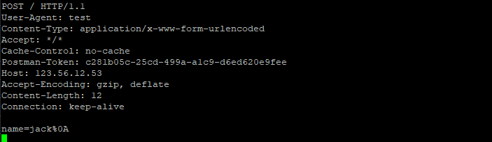

### http协议和websocket协议说明  

- http协议   
请求格式和响应格式：  
[某大神的文章](https://www.cnblogs.com/CodingUniversal/p/7524088.html)      

请求的数据【postman发起】  
 

```php    
POST请求：    application/x-www-form-urlencoded
POST / HTTP/1.1
User-Agent: test
Content-Type: application/x-www-form-urlencoded
Accept: */*
Cache-Control: no-cache
Postman-Token: c281b05c-25cd-499a-a1c9-d6ed620e9fee
Host: 143.536.122.532
Accept-Encoding: gzip, deflate
Content-Length: 12
Connection: keep-alive

name=jack%0A


请求方法 空格 请求URL/ 协议版本\r\n
头部字段名称：头部字段值\r\n
...
空行【\r\n\r\n】  
请求包体内容    
```   

```php    
multipart/form-data   

POST / HTTP/1.1
User-Agent: test
Content-Type: multipart/form-data; boundary=--------------------------844099519182533031360164
Accept: */*
Cache-Control: no-cache
Postman-Token: e9667bee-3a4f-4a41-b468-ce3fc0ca3638
Host: 143.536.122.532
Accept-Encoding: gzip, deflate
Content-Length: 163
Connection: keep-alive

----------------------------844099519182533031360164
Content-Disposition: form-data; name="name"

lucy
----------------------------844099519182533031360164--


```  

```php  
POST / HTTP/1.1
User-Agent: test
Content-Type: application/x-www-form-urlencoded
Accept: */*
Cache-Control: no-cache
Postman-Token: 952fc40e-e67d-46bb-983e-77cdbef55da7
Host: 143.536.122.532
Accept-Encoding: gzip, deflate
Content-Length: 24
Connection: keep-alive

<?php

        echo 'hi,world';


```  

文件  
```php  
POST / HTTP/1.1
Host: 143.536.122.532
Connection: keep-alive
Content-Length: 524
Cache-Control: max-age=0
Upgrade-Insecure-Requests: 1
Origin: null
Content-Type: multipart/form-data; boundary=----WebKitFormBoundarySoDemhk5Cmjlr1hh
User-Agent: Mozilla/5.0 (Windows NT 10.0; Win64; x64) AppleWebKit/537.36 (KHTML, like Gecko) Chrome/73.0.3683.86 Safari/537.36
Accept: text/html,application/xhtml+xml,application/xml;q=0.9,image/webp,image/apng,*/*;q=0.8,application/signed-exchange;v=b3
Accept-Encoding: gzip, deflate
Accept-Language: zh-CN,zh;q=0.9

------WebKitFormBoundarySoDemhk5Cmjlr1hh
Content-Disposition: form-data; name="lname"; filename="grammer.txt"
Content-Type: text/plain

▒▒▒▒▒▒▒▒▒     ▒▒״▒▒-▒▒▒ʡ▒ν▒▒▒▒-▒▒▒▒▒▒▒▒ ▒▒▒▒▒  ▒▒▒▒▒▒

             ▒▒▒                                            ▒▒▒     ▒▒▒                    ▒▒▒
  ▒▒▒ݴ▒                                                   ▒▒▒ݴ▒   ▒▒▒ݴ▒
                         ▒▒▒▒
                                             ▒▒▒▒
------WebKitFormBoundarySoDemhk5Cmjlr1hh--


```  

-  请求内容解析  
` call_user_func($this->onMessage, $this, $parser::decode($one_request_buffer, $this));`   
```php  
public static function decode($recv_buffer, TcpConnection $connection)
    {
    //初始化超级变量
        // Init.
        $_POST                         = $_GET = $_COOKIE = $_REQUEST = $_SESSION = $_FILES = array();
        $GLOBALS['HTTP_RAW_POST_DATA'] = '';
        // Clear cache.
        HttpCache::$header   = array('Connection' => 'Connection: keep-alive');
        HttpCache::$instance = new HttpCache();
        // $_SERVER
        $_SERVER = array(
            'QUERY_STRING'         => '',
            'REQUEST_METHOD'       => '',
            'REQUEST_URI'          => '',
            'SERVER_PROTOCOL'      => '',
            'SERVER_SOFTWARE'      => 'workerman/'.Worker::VERSION,
            'SERVER_NAME'          => '',
            'HTTP_HOST'            => '',
            'HTTP_USER_AGENT'      => '',
            'HTTP_ACCEPT'          => '',
            'HTTP_ACCEPT_LANGUAGE' => '',
            'HTTP_ACCEPT_ENCODING' => '',
            'HTTP_COOKIE'          => '',
            'HTTP_CONNECTION'      => '',
            'CONTENT_TYPE'         => '',
            'REMOTE_ADDR'          => '',
            'REMOTE_PORT'          => '0',
            'REQUEST_TIME'         => time()
        );
        
        //
        // Parse headers.
        //通过回车符\换行符号分割得到请求头部+请求内容【  
        /***
        请求行\r\n
        请求头部\r\n
        \r\n\r\n
        请求包体
        ***/
        list($http_header, $http_body) = explode("\r\n\r\n", $recv_buffer, 2);
        
        //请求头部拆分【按行】  
        /**
        xxx:yyy\r\n
        zzz:bbb\r\n
        HOST:ip:port\r\n
        **/
        $header_data = explode("\r\n", $http_header);
        //按空格取得请求行的请求方法，url,协议
        list($_SERVER['REQUEST_METHOD'], $_SERVER['REQUEST_URI'], $_SERVER['SERVER_PROTOCOL']) = explode(' ',
            $header_data[0]);

        $http_post_boundary = '';
        unset($header_data[0]);//删除请求行，防止下面出错
        foreach ($header_data as $content) {
            // \r\n\r\n
            //请求行是空行的处理
            if (empty($content)) {
                continue;
            }
            //通过：号分割得到请求头部字段名称=请求头部字段对应值
            list($key, $value)       = explode(':', $content, 2);
            //把头部字段名称的-线换成_这种，并且头部字段名称转换为大写
            $key                     = str_replace('-', '_', strtoupper($key));
            //头部字段的值
            $value                   = trim($value);
            //存储头部字段
            $_SERVER['HTTP_' . $key] = $value;
            switch ($key) {
                // HTTP_HOST
                case 'HOST':
                    $tmp                    = explode(':', $value);  
                    //获取请求ip
                    $_SERVER['SERVER_NAME'] = $tmp[0];
                    if (isset($tmp[1])) {
                    //请求端口号
                        $_SERVER['SERVER_PORT'] = $tmp[1];
                    }
                    break;
                // cookie
                case 'COOKIE':
                //str_replace('; ', '&', $_SERVER['HTTP_COOKIE'] 把cookie头部字段的;号替换为&符号  
                //方便parse_str折腾成数组  
                //比如：name=jack&age=100 折腾成数组后放在$_COOKIE上这种样子
                    parse_str(str_replace('; ', '&', $_SERVER['HTTP_COOKIE']), $_COOKIE);
                    break;
                // content-type
                case 'CONTENT_TYPE':  
                //multipart/form-data 表单请求时   
                    if (!preg_match('/boundary="?(\S+)"?/', $value, $match)) {  
                    
                        if ($pos = strpos($value, ';')) {
                            $_SERVER['CONTENT_TYPE'] = substr($value, 0, $pos);
                        } else {
                            $_SERVER['CONTENT_TYPE'] = $value;
                        }
                    } else {
                        $_SERVER['CONTENT_TYPE'] = 'multipart/form-data';  
                        //boundary=----WebKitFormBoundarySoDemhk5Cmjlr1hh  获取后面这个字符串
                        $http_post_boundary      = '--' . $match[1];
                    }
                    break;
                case 'CONTENT_LENGTH':
                //请求的内容长度
                    $_SERVER['CONTENT_LENGTH'] = $value;
                    break;
                case 'UPGRADE':  
                //websocket的处理
					if($value=='websocket'){
						$connection->protocol = "\\Workerman\\Protocols\\Websocket";
						return \Workerman\Protocols\Websocket::input($recv_buffer,$connection);
					}
                    break;
            }
        }
		if(isset($_SERVER['HTTP_ACCEPT_ENCODING']) && strpos($_SERVER['HTTP_ACCEPT_ENCODING'], 'gzip') !== FALSE){
			HttpCache::$gzip = true;
		}
        // Parse $_POST.
        if ($_SERVER['REQUEST_METHOD'] === 'POST') {
            if (isset($_SERVER['CONTENT_TYPE'])) {
                switch ($_SERVER['CONTENT_TYPE']) {
                    case 'multipart/form-data'://表单
                        self::parseUploadFiles($http_body, $http_post_boundary);
                        break;
                    case 'application/json'://json
                        $_POST = json_decode($http_body, true);
                        break;
                    case 'application/x-www-form-urlencoded'://字段名称=字段值&字段1=值1 这种
                        parse_str($http_body, $_POST);
                        break;
                }
            }
        }

        // Parse other HTTP action parameters
        if ($_SERVER['REQUEST_METHOD'] != 'GET' && $_SERVER['REQUEST_METHOD'] != "POST") {
            $data = array();
            if ($_SERVER['CONTENT_TYPE'] === "application/x-www-form-urlencoded") {
                parse_str($http_body, $data);
            } elseif ($_SERVER['CONTENT_TYPE'] === "application/json") {
                $data = json_decode($http_body, true);
            }
            $_REQUEST = array_merge($_REQUEST, $data);
        }

        //存储请求包休的内容
        // HTTP_RAW_REQUEST_DATA HTTP_RAW_POST_DATA
        $GLOBALS['HTTP_RAW_REQUEST_DATA'] = $GLOBALS['HTTP_RAW_POST_DATA'] = $http_body;

        // QUERY_STRING  
        //请求查询字符串拆分并给$_GET保存
        $_SERVER['QUERY_STRING'] = parse_url($_SERVER['REQUEST_URI'], PHP_URL_QUERY);
        if ($_SERVER['QUERY_STRING']) {
            // $GET
            parse_str($_SERVER['QUERY_STRING'], $_GET);
        } else {
            $_SERVER['QUERY_STRING'] = '';
        }

        if (is_array($_POST)) {
            // REQUEST  请求参数合并
            $_REQUEST = array_merge($_GET, $_POST, $_REQUEST);
        } else {
            // REQUEST
            $_REQUEST = array_merge($_GET, $_REQUEST);
        }

        // REMOTE_ADDR REMOTE_PORT
        $_SERVER['REMOTE_ADDR'] = $connection->getRemoteIp();
        $_SERVER['REMOTE_PORT'] = $connection->getRemotePort();

        return array('get' => $_GET, 'post' => $_POST, 'cookie' => $_COOKIE, 'server' => $_SERVER, 'files' => $_FILES);
    }
```      

- 文件解析   
```php  
protected static function parseUploadFiles($http_body, $http_post_boundary)
    {
    /**
    $http_body原内容是这样的  
    ------WebKitFormBoundaryF3MDS3U6uQFGzppT\r\n
    Content-Disposition: form-data; name="lname"; filename="grammer.txt"
    Content-Type: text/plain
    
    ▒▒▒▒▒▒▒▒▒     ▒▒״▒▒-▒▒▒ʡ▒ν▒▒▒▒-▒▒▒▒▒▒▒▒ ▒▒▒▒▒  ▒▒▒▒▒▒
    
                 ▒▒▒                                            ▒▒▒     ▒▒▒                    ▒▒▒
      ▒▒▒ݴ▒                                                   ▒▒▒ݴ▒   ▒▒▒ݴ▒
                             ▒▒▒▒
                                                 ▒▒▒▒
    ------WebKitFormBoundaryF3MDS3U6uQFGzppT--

$http_post_boundary=------WebKitFormBoundaryF3MDS3U6uQFGzppT   
$http_post_boundary      = '--' . $match[1];  //这就是为什么要加上--的原因了   
  

    **/
    //获取获取请求包休内容  
    //(strlen($http_post_boundary) + 4)  = ------WebKitFormBoundaryF3MDS3U6uQFGzppT\r\n  
    /**
    $http_body最终得到的结果是：  
    ------WebKitFormBoundaryF3MDS3U6uQFGzppT\r\n
        Content-Disposition: form-data; name="lname"; filename="grammer.txt"
        Content-Type: text/plain
        
        ▒▒▒▒▒▒▒▒▒     ▒▒״▒▒-▒▒▒ʡ▒ν▒▒▒▒-▒▒▒▒▒▒▒▒ ▒▒▒▒▒  ▒▒▒▒▒▒
        
                     ▒▒▒                                            ▒▒▒     ▒▒▒                    ▒▒▒
          ▒▒▒ݴ▒                                                   ▒▒▒ݴ▒   ▒▒▒ݴ▒
                                 ▒▒▒▒
                                                     ▒▒▒▒  
                                                     
    **/
        $http_body           = substr($http_body, 0, strlen($http_body) - (strlen($http_post_boundary) + 4));
        
        /**  
        $boundary_data_array的结果是如下：
        Array
        (
            [0] =>
            [1] => Content-Disposition: form-data; name="lname"; filename="grammer.txt"
        Content-Type: text/plain
        
        ▒▒▒▒▒▒▒▒▒     ▒▒״▒▒-▒▒▒ʡ▒ν▒▒▒▒-▒▒▒▒▒▒▒▒ ▒▒▒▒▒  ▒▒▒▒▒▒
        
                     ▒▒▒                                            ▒▒▒     ▒▒▒                    ▒▒▒
          ▒▒▒ݴ▒                                                   ▒▒▒ݴ▒   ▒▒▒ݴ▒
                                 ▒▒▒▒
                                                     ▒▒▒▒
        
        )
        
        **/
        $boundary_data_array = explode($http_post_boundary . "\r\n", $http_body);
        if ($boundary_data_array[0] === '') {
            unset($boundary_data_array[0]);
        }
        $key = -1;
        
        
        foreach ($boundary_data_array as $boundary_data_buffer) {
        
            //得到$boundary_header_buffer头部字段  
            //$boundary_value 得到文件的内容   
            list($boundary_header_buffer, $boundary_value) = explode("\r\n\r\n", $boundary_data_buffer, 2);
            
            // Remove \r\n from the end of buffer.
            $boundary_value = substr($boundary_value, 0, -2);
            $key ++;
            
            
            foreach (explode("\r\n", $boundary_header_buffer) as $item) {
            
                //获取文件头部字段
                list($header_key, $header_value) = explode(": ", $item);
                $header_key = strtolower($header_key);
                switch ($header_key) {
                    case "content-disposition":
                        // Is file data.  
                        //开始装载文件数据啦
                        if (preg_match('/name="(.*?)"; filename="(.*?)"$/', $header_value, $match)) {
                            // Parse $_FILES.
                            $_FILES[$key] = array(
                                'name' => $match[1],
                                'file_name' => $match[2],
                                'file_data' => $boundary_value,
                                'file_size' => strlen($boundary_value),
                            );
                            break;
                        } // Is post field.
                        else {
                            // Parse $_POST.
                            if (preg_match('/name="(.*?)"$/', $header_value, $match)) {
                                $_POST[$match[1]] = $boundary_value;
                            }
                        }
                        break;
                    case "content-type":
                        // add file_type
                        $_FILES[$key]['file_type'] = trim($header_value);
                        break;
                }
            }
        }
    }
```  

- 响应内容处理   
```php  
 public function send($send_buffer, $raw = false)
    {
        if ($this->_status === self::STATUS_CLOSING || $this->_status === self::STATUS_CLOSED) {
            return false;
        }

        // Try to call protocol::encode($send_buffer) before sending.
        if (false === $raw && $this->protocol !== null) {
            $parser      = $this->protocol;
            $send_buffer = $parser::encode($send_buffer, $this);
            if ($send_buffer === '') {
                return null;
            }
        }

        if ($this->_status !== self::STATUS_ESTABLISHED ||
            ($this->transport === 'ssl' && $this->_sslHandshakeCompleted !== true)
        ) {
            if ($this->_sendBuffer) {
                if ($this->bufferIsFull()) {
                    self::$statistics['send_fail']++;
                    return false;
                }
            }
            $this->_sendBuffer .= $send_buffer;
            $this->checkBufferWillFull();
            return null;
        }

        // Attempt to send data directly.
        if ($this->_sendBuffer === '') {
            if ($this->transport === 'ssl') {
                Worker::$globalEvent->add($this->_socket, EventInterface::EV_WRITE, array($this, 'baseWrite'));
                $this->_sendBuffer = $send_buffer;
                $this->checkBufferWillFull();
                return null;
            }
            set_error_handler(function(){});
            $len = fwrite($this->_socket, $send_buffer);
            restore_error_handler();
            // send successful.
            if ($len === strlen($send_buffer)) {
                $this->bytesWritten += $len;
                return true;
            }
            // Send only part of the data.
            if ($len > 0) {
                $this->_sendBuffer = substr($send_buffer, $len);
                $this->bytesWritten += $len;
            } else {
                // Connection closed?
                if (!is_resource($this->_socket) || feof($this->_socket)) {
                    self::$statistics['send_fail']++;
                    if ($this->onError) {
                        try {
                            call_user_func($this->onError, $this, WORKERMAN_SEND_FAIL, 'client closed');
                        } catch (\Exception $e) {
                            Worker::log($e);
                            exit(250);
                        } catch (\Error $e) {
                            Worker::log($e);
                            exit(250);
                        }
                    }
                    $this->destroy();
                    return false;
                }
                $this->_sendBuffer = $send_buffer;
            }
            Worker::$globalEvent->add($this->_socket, EventInterface::EV_WRITE, array($this, 'baseWrite'));
            // Check if the send buffer will be full.
            $this->checkBufferWillFull();
            return null;
        } else {
            if ($this->bufferIsFull()) {
                self::$statistics['send_fail']++;
                return false;
            }

            $this->_sendBuffer .= $send_buffer;
            // Check if the send buffer is full.
            $this->checkBufferWillFull();
        }
    }
```   

- ` $send_buffer = $parser::encode($send_buffer, $this);`      

```php    
响应格式说明：
响应状态行\r\n
响应头部字段\r\n
\r\n\r\n
响应内容  

public static function encode($content, TcpConnection $connection)
    {
        // Default http-code.
        if (!isset(HttpCache::$header['Http-Code'])) {
            $header = "HTTP/1.1 200 OK\r\n";  //设置响应头
        } else {
            $header = HttpCache::$header['Http-Code'] . "\r\n";
            unset(HttpCache::$header['Http-Code']);
        }

        // Content-Type  
        //设置响应内容类型  默认是html网页
        if (!isset(HttpCache::$header['Content-Type'])) {
            $header .= "Content-Type: text/html;charset=utf-8\r\n";
        }

        // other headers
        foreach (HttpCache::$header as $key => $item) {
            if ('Set-Cookie' === $key && is_array($item)) {
                foreach ($item as $it) {
                    $header .= $it . "\r\n";
                }
            } else {
                $header .= $item . "\r\n";
            }
        }
		if(HttpCache::$gzip && isset($connection->gzip) && $connection->gzip){
			$header .= "Content-Encoding: gzip\r\n";
			$content = gzencode($content,$connection->gzip);
		}
        // header  
        //响应头部拼装
        $header .= "Server: workerman/" . Worker::VERSION . "\r\nContent-Length: " . strlen($content) . "\r\n\r\n";

        // save session
        self::sessionWriteClose();

        // the whole http package
        return $header . $content;
    }

```   

- websocket协议解析   

【记得先看workerman源码解析部分和websocket协议】   
```php  
public static function input($buffer, ConnectionInterface $connection)
    {
        // Receive length.
        $recv_len = strlen($buffer);
        // We need more data.
        if ($recv_len < 6) {
            return 0;
        }

        // Has not yet completed the handshake.  
        //websocket握手处理
        if (empty($connection->websocketHandshake)) {
            return static::dealHandshake($buffer, $connection);
        }

        // Buffer websocket frame data.
        if ($connection->websocketCurrentFrameLength) {
            // We need more frame data.
            if ($connection->websocketCurrentFrameLength > $recv_len) {
                // Return 0, because it is not clear the full packet length, waiting for the frame of fin=1.
                return 0;
            }
        } else {
            $firstbyte    = ord($buffer[0]);
            $secondbyte   = ord($buffer[1]);
            $data_len     = $secondbyte & 127;
            $is_fin_frame = $firstbyte >> 7;
            $masked       = $secondbyte >> 7;

            if (!$masked) {
                Worker::safeEcho("frame not masked so close the connection\n");
                $connection->close();
                return 0;
            }

            $opcode       = $firstbyte & 0xf;
            switch ($opcode) {
                case 0x0:
                    break;
                // Blob type.
                case 0x1:
                    break;
                // Arraybuffer type.
                case 0x2:
                    break;
                // Close package.
                case 0x8:
                    // Try to emit onWebSocketClose callback.
                    if (isset($connection->onWebSocketClose) || isset($connection->worker->onWebSocketClose)) {
                        try {
                            call_user_func(isset($connection->onWebSocketClose)?$connection->onWebSocketClose:$connection->worker->onWebSocketClose, $connection);
                        } catch (\Exception $e) {
                            Worker::log($e);
                            exit(250);
                        } catch (\Error $e) {
                            Worker::log($e);
                            exit(250);
                        }
                    } // Close connection.
                    else {
                        $connection->close("\x88\x02\x27\x10", true);
                    }
                    return 0;
                // Ping package.
                case 0x9:
                    break;
                // Pong package.
                case 0xa:
                    break;
                // Wrong opcode. 
                default :
                    Worker::safeEcho("error opcode $opcode and close websocket connection. Buffer:" . bin2hex($buffer) . "\n");
                    $connection->close();
                    return 0;
            }

            // Calculate packet length.
            $head_len = 6;
            if ($data_len === 126) {
                $head_len = 8;
                if ($head_len > $recv_len) {
                    return 0;
                }
                $pack     = unpack('nn/ntotal_len', $buffer);
                $data_len = $pack['total_len'];
            } else {
                if ($data_len === 127) {
                    $head_len = 14;
                    if ($head_len > $recv_len) {
                        return 0;
                    }
                    $arr      = unpack('n/N2c', $buffer);
                    $data_len = $arr['c1']*4294967296 + $arr['c2'];
                }
            }
            $current_frame_length = $head_len + $data_len;

            $total_package_size = strlen($connection->websocketDataBuffer) + $current_frame_length;
            if ($total_package_size > $connection->maxPackageSize) {
                Worker::safeEcho("error package. package_length=$total_package_size\n");
                $connection->close();
                return 0;
            }

            if ($is_fin_frame) {
                if ($opcode === 0x9) {
                    if ($recv_len >= $current_frame_length) {
                        $ping_data = static::decode(substr($buffer, 0, $current_frame_length), $connection);
                        $connection->consumeRecvBuffer($current_frame_length);
                        $tmp_connection_type = isset($connection->websocketType) ? $connection->websocketType : static::BINARY_TYPE_BLOB;
                        $connection->websocketType = "\x8a";
                        if (isset($connection->onWebSocketPing) || isset($connection->worker->onWebSocketPing)) {
                            try {
                                call_user_func(isset($connection->onWebSocketPing)?$connection->onWebSocketPing:$connection->worker->onWebSocketPing, $connection, $ping_data);
                            } catch (\Exception $e) {
                                Worker::log($e);
                                exit(250);
                            } catch (\Error $e) {
                                Worker::log($e);
                                exit(250);
                            }
                        } else {
                            $connection->send($ping_data);
                        }
                        $connection->websocketType = $tmp_connection_type;
                        if ($recv_len > $current_frame_length) {
                            return static::input(substr($buffer, $current_frame_length), $connection);
                        }
                    }
                    return 0;
                } else if ($opcode === 0xa) {
                    if ($recv_len >= $current_frame_length) {
                        $pong_data = static::decode(substr($buffer, 0, $current_frame_length), $connection);
                        $connection->consumeRecvBuffer($current_frame_length);
                        $tmp_connection_type = isset($connection->websocketType) ? $connection->websocketType : static::BINARY_TYPE_BLOB;
                        $connection->websocketType = "\x8a";
                        // Try to emit onWebSocketPong callback.
                        if (isset($connection->onWebSocketPong) || isset($connection->worker->onWebSocketPong)) {
                            try {
                                call_user_func(isset($connection->onWebSocketPong)?$connection->onWebSocketPong:$connection->worker->onWebSocketPong, $connection, $pong_data);
                            } catch (\Exception $e) {
                                Worker::log($e);
                                exit(250);
                            } catch (\Error $e) {
                                Worker::log($e);
                                exit(250);
                            }
                        }
                        $connection->websocketType = $tmp_connection_type;
                        if ($recv_len > $current_frame_length) {
                            return static::input(substr($buffer, $current_frame_length), $connection);
                        }
                    }
                    return 0;
                }
                return $current_frame_length;
            } else {
                $connection->websocketCurrentFrameLength = $current_frame_length;
            }
        }

        // Received just a frame length data.
        if ($connection->websocketCurrentFrameLength === $recv_len) {
            static::decode($buffer, $connection);
            $connection->consumeRecvBuffer($connection->websocketCurrentFrameLength);
            $connection->websocketCurrentFrameLength = 0;
            return 0;
        } // The length of the received data is greater than the length of a frame.
        elseif ($connection->websocketCurrentFrameLength < $recv_len) {
            static::decode(substr($buffer, 0, $connection->websocketCurrentFrameLength), $connection);
            $connection->consumeRecvBuffer($connection->websocketCurrentFrameLength);
            $current_frame_length                    = $connection->websocketCurrentFrameLength;
            $connection->websocketCurrentFrameLength = 0;
            // Continue to read next frame.
            return static::input(substr($buffer, $current_frame_length), $connection);
        } // The length of the received data is less than the length of a frame.
        else {
            return 0;
        }
    }
```  

- websocket请求数据   
```php  
GET / HTTP/1.1
Host: 123.56.12.53:2346
Connection: Upgrade
Pragma: no-cache
Cache-Control: no-cache
Upgrade: websocket
Origin: file://
Sec-WebSocket-Version: 13
User-Agent: Mozilla/5.0 (Windows NT 10.0; Win64; x64) AppleWebKit/537.36 (KHTML, like Gecko) Chrome/73.0.3683.86 Safari/537.36
Accept-Encoding: gzip, deflate
Accept-Language: zh-CN,zh;q=0.9
Sec-WebSocket-Key: d9jqb7Npp8DxB65iP+OGSQ==
Sec-WebSocket-Extensions: permessage-deflate; client_max_window_bits

//websocket的数据
hand_data:▒▒a▒▒0▒'M▒▒):▒▒NQ▒

```
- websocket握手协议解析【响应】     
```php  
 protected static function dealHandshake($buffer, $connection)
    {
        // HTTP protocol.
        if (0 === strpos($buffer, 'GET')) {
            // Find \r\n\r\n.
            $heder_end_pos = strpos($buffer, "\r\n\r\n");
            if (!$heder_end_pos) {
                return 0;
            }
            $header_length = $heder_end_pos + 4;
            //获取Sec-WebSocket-Key 
            // Get Sec-WebSocket-Key.
            $Sec_WebSocket_Key = '';
            if (preg_match("/Sec-WebSocket-Key: *(.*?)\r\n/i", $buffer, $match)) {
                $Sec_WebSocket_Key = $match[1];
            } else { 
            //不是websocket时直接关闭请求
                $connection->send("HTTP/1.1 200 Websocket\r\nServer: workerman/".Worker::VERSION."\r\n\r\n<div style=\"text-align:center\"><h1>Websocket</h1><hr>powerd by <a href=\"https://www.workerman.net\">workerman ".Worker::VERSION."</a></div>",
                    true);
                $connection->close();
                return 0;
            }
            // Calculation websocket key.  
            //计算ws 新key
            $new_key = base64_encode(sha1($Sec_WebSocket_Key . "258EAFA5-E914-47DA-95CA-C5AB0DC85B11", true));
            // Handshake response data.  
            //切换协议   
            //请求的头部字段和响应字段完全一致
            $handshake_message = "HTTP/1.1 101 Switching Protocols\r\n";
            $handshake_message .= "Upgrade: websocket\r\n";
            $handshake_message .= "Sec-WebSocket-Version: 13\r\n";
            $handshake_message .= "Connection: Upgrade\r\n";
            $handshake_message .= "Sec-WebSocket-Accept: " . $new_key . "\r\n";

            // Websocket data buffer.
            $connection->websocketDataBuffer = '';
            // Current websocket frame length.
            $connection->websocketCurrentFrameLength = 0;
            // Current websocket frame data.
            $connection->websocketCurrentFrameBuffer = '';
            // Consume handshake data.
            $connection->consumeRecvBuffer($header_length);

            // blob or arraybuffer
            if (empty($connection->websocketType)) {
                $connection->websocketType = static::BINARY_TYPE_BLOB;
            }

            $has_server_header = false;
            //运行用户自定义的握手协议
            // Try to emit onWebSocketConnect callback.
            if (isset($connection->onWebSocketConnect) || isset($connection->worker->onWebSocketConnect)) {
                static::parseHttpHeader($buffer);
                try {
                    call_user_func(isset($connection->onWebSocketConnect)?$connection->onWebSocketConnect:$connection->worker->onWebSocketConnect, $connection, $buffer);
                } catch (\Exception $e) {
                    Worker::log($e);
                    exit(250);
                } catch (\Error $e) {
                    Worker::log($e);
                    exit(250);
                }
                if (!empty($_SESSION) && class_exists('\GatewayWorker\Lib\Context')) {
                    $connection->session = \GatewayWorker\Lib\Context::sessionEncode($_SESSION);
                }
                $_GET = $_SERVER = $_SESSION = $_COOKIE = array();

                if (isset($connection->headers)) {
                    if (is_array($connection->headers))  {
                        foreach ($connection->headers as $header) {
                            if (strpos($header, 'Server:') === 0) {
                                $has_server_header = true;
                            }
                            $handshake_message .= "$header\r\n";
                        }
                    } else {
                        $handshake_message .= "$connection->headers\r\n";
                    }
                }
            }
            if (!$has_server_header) {
                $handshake_message .= "Server: workerman/".Worker::VERSION."\r\n";
            }
            $handshake_message .= "\r\n";
            // Send handshake response.  
            //发送握手响应【之后接受的数据全是websocket报文了，需要解析】   
            $connection->send($handshake_message, true);
            // Mark handshake complete..
            $connection->websocketHandshake = true;
            // There are data waiting to be sent.
            if (!empty($connection->tmpWebsocketData)) {
                $connection->send($connection->tmpWebsocketData, true);
                $connection->tmpWebsocketData = '';
            }
            if (strlen($buffer) > $header_length) {
                return static::input(substr($buffer, $header_length), $connection);
            }
            return 0;
        } // Is flash policy-file-request.
        elseif (0 === strpos($buffer, '<polic')) {
            $policy_xml = '<?xml version="1.0"?><cross-domain-policy><site-control permitted-cross-domain-policies="all"/><allow-access-from domain="*" to-ports="*"/></cross-domain-policy>' . "\0";
            $connection->send($policy_xml, true);
            $connection->consumeRecvBuffer(strlen($buffer));
            return 0;
        }
        // Bad websocket handshake request.
        $connection->send("HTTP/1.1 200 Websocket\r\nServer: workerman/".Worker::VERSION."\r\n\r\n<div style=\"text-align:center\"><h1>Websocket</h1><hr>powerd by <a href=\"https://www.workerman.net\">workerman ".Worker::VERSION."</a></div>",
            true);
        $connection->close();
        return 0;
    }
```


