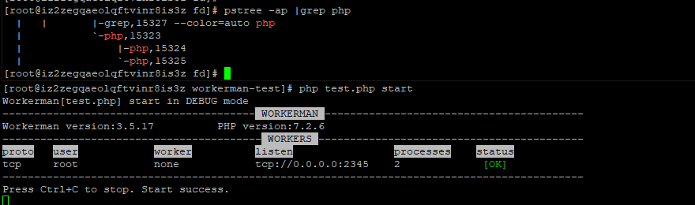
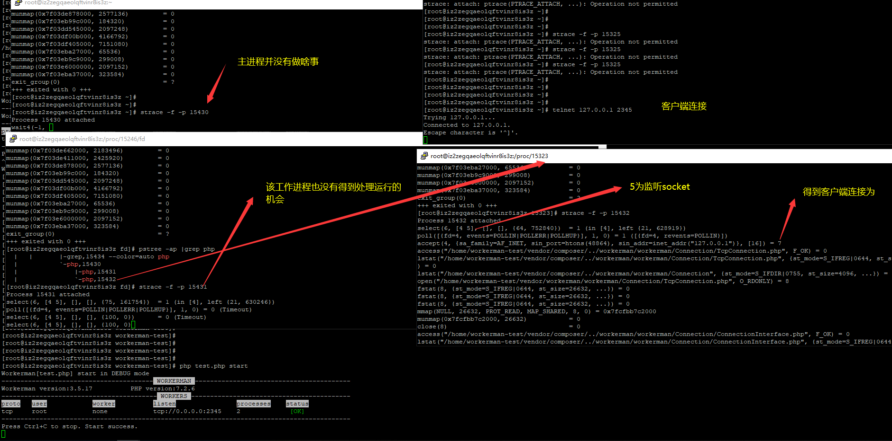
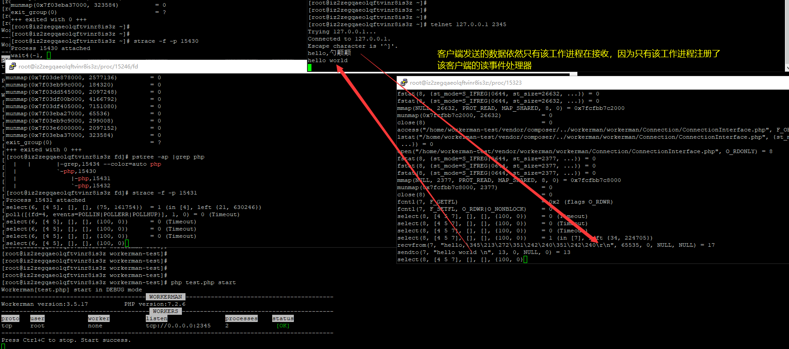
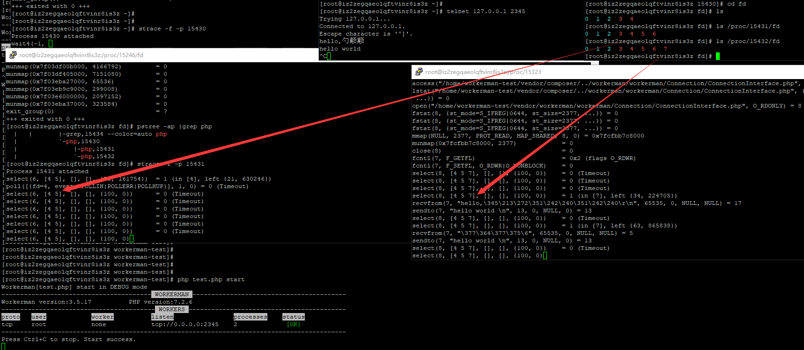

### worker 运行时进程分析  
 
Select IO复用测试   
主进程在做什么
在wait在阻塞状态中，主进程啥事都没有做  

 

工作子进程在干嘛   
 
   

工作子进程在监听内核事件中，其它5文件描述符为监听socket 
4为子进程创建的socket_pair双向流管道文件    

使用telnet 工具连接时  

 
 
  

通过观察只有一个工作进程处理了客户端的连接和数据传输任务    
以上只是某个工作进程运行的动态过程。     

##框架 TCP/UDP 传输层协议之Select I/O和libevent【epoll I/O复用】运行流程完整图  
建议自行下载观看！！！浏览器可能会死的！！！
【应用层协议http,websocket,ws,text等骚协议百度讲烂了没有必要再重复】  
  

