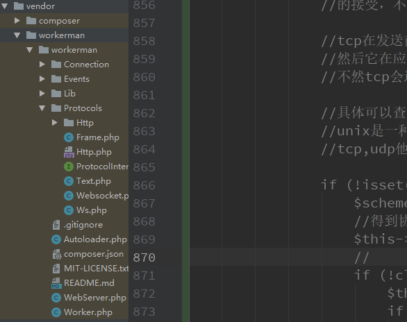

### 启动分析  

- 测试源码    
```php  
<?php
/**
 * Created by PhpStorm.
 * User: 1655664358@qq.com
 * Date: 2019/7/10
 * Time: 21:53
 */

require_once 'vendor/autoload.php';

$worker = new \Workerman\Worker("http://127.0.0.1:1234");
$worker->count=4;

$worker->onMessage=function ($connection,$data){
    print_r($_POST);
    $connection->send("hello,world");
};

\Workerman\Worker::runAll();
```  

- 构造函数分析     
本类已经引入require_once __DIR__ . '/Lib/Constants.php';  
一些常量定义文件,后面它会引用到
 ```php  
  public function __construct($socket_name = '', $context_option = array())
     {
         // Save all worker instances.
         //生成唯一的hash值
         $this->workerId                    = spl_object_hash($this);
         static::$_workers[$this->workerId] = $this;
         static::$_pidMap[$this->workerId]  = array();
 
         // Get autoload root path.
         //得到产生一条回溯跟踪
         //https://www.php.net/manual/zh/function.debug-backtrace.php 文档说明
         $backtrace                = debug_backtrace();
         //得到运行的根目录 
         $this->_autoloadRootPath = dirname($backtrace[0]['file']);
 
         // Context for socket.
         //协议名称
         if ($socket_name) {
             $this->_socketName = $socket_name;
             //流配置选项
             //tcp协议是基于字节流的传输，采用应答机制 
             //低层可通过调用set_socket_opt选项【c语言】控制
             //也可以修改内核配置[linux内核] 
             //从而控制文件描述符的属性 
             //上层协议可以是http,ws,https,这些协议
             if (!isset($context_option['socket']['backlog'])) {
                 $context_option['socket']['backlog'] = static::DEFAULT_BACKLOG;
             }
             //创建一个流  
             //流的概念：
             //流就是一种数据，它的来源有文件【文件流】，网络【如socket】，硬盘，键盘等硬件
             //文件流：数据从文件【源】加载到内存的过程称为输入流 
             //数据从内存写入文件的过程叫做输出流
             //数据在数据源和内存【程序】之间进行传输的过程就叫数据流DATA STREAM
             //数据从数据源码加载到内存【程序】叫做【如给变量赋值】叫做输入流INPUT STREAM
             //数据从内存【程序】流向数据源码的过程叫做输出流OUTPUT STREAM 
             //最好有点编程经验，不然听不懂流概念我也没办法救你了^_^  
             
             //所以网络【tcp字节流，要不要去看看tcp和udp的区别？】
             //或是去了解下tcp/ip协议？可以去阅读本人在laravel-china社区编写过的内容 
             //天天撸api接口，天天操文件，天天操键盘，操鼠标，看片【应该了解流吧^_^】
             
             $this->_context = stream_context_create($context_option);
         }
     }
 ```  
 
- 给onMessage传递一个匿名函数    
  public $onMessage = null;
 ```php  
 $worker->onMessage=function ($connection,$data){
     print_r($_POST);
     $connection->send("hello,world");
 };
 ```   
 
- run运行  
```php  
public static function runAll()
    {
        static::checkSapiEnv();
        static::init();
        static::lock();
        static::parseCommand();
        static::daemonize();
        static::initWorkers();
        static::installSignal();
        static::saveMasterPid();
        static::unlock();
        static::displayUI();
        static::forkWorkers();
        static::resetStd();
        static::monitorWorkers();
    }
```  

   -  static::checkSapiEnv();分析    
   源码  
   ```php  
   protected static function checkSapiEnv()
       {
           // Only for cli.
           if (php_sapi_name() != "cli") {
               exit("only run in command line mode \n");
           }
           if (DIRECTORY_SEPARATOR === '\\') {
               self::$_OS = OS_TYPE_WINDOWS;
           }
       }
   ```  
   得到php的运行模式 
   文档[运行模式](https://www.php.net/manual/zh/function.php-sapi-name.php)  
   这没啥可以说的吧,后面那常量就是常量定义文件里的东西 
   `define('OS_TYPE_WINDOWS', 'windows');`   
   
   -  static::init();  
   ```php  
   protected static function init()
       {
       //这个是设置自定义错误处理方法
       //作为phper码农不可能没用过，除非你看片了
           set_error_handler(function($code, $msg, $file, $line){
               Worker::safeEcho("$msg in file $file on line $line\n");
           });
   
           // Start file.  
           //这个不用说了吧，打印一条信息【追溯】
           $backtrace        = debug_backtrace(); 
           //得到运行的文件名称【别说看不懂】
           static::$_startFile = $backtrace[count($backtrace) - 1]['file'];
   
            //把\【linux】/[windows】替换为_线
           $unique_prefix = str_replace('/', '_', static::$_startFile);
   
           // Pid file. 
           //进程pid文件
           if (empty(static::$pidFile)) {
               static::$pidFile = __DIR__ . "/../$unique_prefix.pid";
           }
   
           // Log file.
           //workerman日志文件
           if (empty(static::$logFile)) {
               static::$logFile = __DIR__ . '/../workerman.log';
           }
           $log_file = (string)static::$logFile;
           //创建日志文件
           if (!is_file($log_file)) {
               touch($log_file);
               chmod($log_file, 0622);
           }
   
           // State.
           //状态初始值
           static::$_status = static::STATUS_STARTING;
   
           // For statistics.
           //启动时间
           static::$_globalStatistics['start_timestamp'] = time(); 
           //sys_get_temp_dir()取得临时目录+启动文件的唯一后缀名称
           static::$_statisticsFile                      = sys_get_temp_dir() . "/$unique_prefix.status";
   
           // Process title.
           //设置进程名称
           static::setProcessTitle('WorkerMan: master process  start_file=' . static::$_startFile);
   
           // Init data for worker id.
           static::initId();
   
           // Timer init.
           Timer::init();
       }

   ```  
   看看它的打印显示函数  
   ```php  
    public static function safeEcho($msg, $decorated = false)
       {
       //这地方怎么，回事啊，看下面的解释
           $stream = static::outputStream();
           if (!$stream) {
               return false;
           }
           //颜色处理【具体去看linux的终端处理，不要跟我说不会百度】
           if (!$decorated) {
               $line = $white = $green = $end = '';
               if (static::$_outputDecorated) {
                   $line = "\033[1A\n\033[K";
                   $white = "\033[47;30m";
                   $green = "\033[32;40m";
                   $end = "\033[0m";
               }
               $msg = str_replace(array('<n>', '<w>', '<g>'), array($line, $white, $green), $msg);
               $msg = str_replace(array('</n>', '</w>', '</g>'), $end, $msg);
           } elseif (!static::$_outputDecorated) {
               return false;
           }
           //数据从内存【php程序】流向数据源【屏幕终端】
           fwrite($stream, $msg);
           //清空输出
           fflush($stream);
           return true;
       }
   ```   
   
   再继续  
   ```php  
   private static function outputStream($stream = null)
       {
           if (!$stream) {
           //STDOUT是个什么东西啊？
           //这里就要说一下linux中所有的硬件全映射成文件了【为什么？自己去想】
           //输入设备：如键盘，鼠标等映射为stdin/STDIN
           //输出设备：如显示器，映射为stdout/STDOUT，stderr/STDERR   
           //打印机：stdprn一般我们不用  
           //这些文件一般映射到对应的硬件设备【只要操作一下内存中的数据会流向这些设备】
           //所以你应该听过输出缓冲区，输入缓冲区吧  
           //要不你去翻一下你大学时学c时的概念呗
               $stream = static::$_outputStream ? static::$_outputStream : STDOUT;
           }
           if (!$stream || !is_resource($stream) || 'stream' !== get_resource_type($stream)) {
               return false;
           }
           
           $stat = fstat($stream);  
           
           //检测是不是普通文件---具体解释看下面stat的解释  
           //看不懂？那回家放牛吧
           if (($stat['mode'] & 0170000) === 0100000) {
               // file
               static::$_outputDecorated = false;
           } else {
               static::$_outputDecorated =
                   static::$_OS === OS_TYPE_LINUX &&
                   function_exists('posix_isatty') &&
                   posix_isatty($stream);  
                   
                   //https://www.php.net/manual/zh/function.posix-isatty.php  
                   //如果STDOUT不是常规的文件 
                   //static::$_outputDecorated 
                   //static::$_OS 
                   //判断STDOUT是否是可交互式终端【就是终端能否输入东西进入交互模式】  
                   
           }
           //返回STDOUT 交互式的输出终端流【输出流】
           return static::$_outputStream = $stream;
       }

   ```  
   fstat【stat访问文件详细信息】用于访问文件接口的函数，返回文件的相关信息，基本返回如下内容   
   [fstat函数说明](https://www.php.net/manual/zh/function.stat.php)
   ```php  
   Array
   (
       [0] => 1
       [1] => 0
       [2] => 4096
       [3] => 1
       [4] => 0
       [5] => 0
       [6] => 1
       [7] => 0
       [8] => 0
       [9] => 0
       [10] => 0
       [11] => -1
       [12] => -1
       [dev] => 1//所在的设备标识
       [ino] => 0//文件结点号
       [mode] => 4096//文件保护模式
       [nlink] => 1//硬连接数
       [uid] => 0//文件用户标识
       [gid] => 0//组标识
       [rdev] => 1//文件所表示的特殊设备文件的设备标识
       [size] => 0//文件大小
       [atime] => 0//最后访问时间
       [mtime] => 0//最后修改时间
       [ctime] => 0//最后状态改变时间
       [blksize] => -1//文件系统的块大小
       [blocks] => -1//分配给文件的块数量
   )
   ```  
   下面重点说一下这个stat函数的结构体  
   ```c  
   struct stat
   {
       dev_t st_dev; //device 文件的设备编号
       ino_t st_ino; //inode 文件的i-node
       mode_t st_mode; //protection 文件的类型和存取的权限
       nlink_t st_nlink; //number of hard links 连到该文件的硬连接数目, 刚建立的文件值为1.
       uid_t st_uid; //user ID of owner 文件所有者的用户识别码
       gid_t st_gid; //group ID of owner 文件所有者的组识别码
       dev_t st_rdev; //device type 若此文件为装置设备文件, 则为其设备编号
       off_t st_size; //total size, in bytes 文件大小, 以字节计算
       unsigned long st_blksize; //blocksize for filesystem I/O 文件系统的I/O 缓冲区大小.
       unsigned long st_blocks; //number of blocks allocated 占用文件区块的个数, 每一区块大小为512 个字节.
       time_t st_atime; //time of lastaccess 文件最近一次被存取或被执行的时间, 一般只有在用mknod、utime、read、write 与tructate 时改变.
       time_t st_mtime; //time of last modification 文件最后一次被修改的时间, 一般只有在用mknod、utime 和write 时才会改变
       time_t st_ctime; //time of last change i-node 最近一次被更改的时间, 此参数会在文件所有者、组、权限被更改时更新
   };
   ```    
   
   先前所描述的st_mode 则定义了下列数种情况：    
   1、S_IFMT 0170000 文件类型的位遮罩    
   2、S_IFSOCK 0140000 scoket   
   3、S_IFLNK 0120000 符号连接   
   4、S_IFREG 0100000 一般文件   
   5、S_IFBLK 0060000 区块装置   
   6、S_IFDIR 0040000 目录   
   7、S_IFCHR 0020000 字符装置   
   8、S_IFIFO 0010000 先进先出   
   9、S_ISUID 04000 文件的 (set user-id on execution)位   
   10、S_ISGID 02000 文件的 (set group-id on execution)位   
   11、S_ISVTX 01000 文件的sticky 位   
   12、S_IRUSR (S_IREAD) 00400 文件所有者具可读取权限   
   13、S_IWUSR (S_IWRITE)00200 文件所有者具可写入权限   
   14、S_IXUSR (S_IEXEC) 00100 文件所有者具可执行权限   
   15、S_IRGRP 00040 用户组具可读取权限   
   16、S_IWGRP 00020 用户组具可写入权限   
   17、S_IXGRP 00010 用户组具可执行权限   
   18、S_IROTH 00004 其他用户具可读取权限   
   19、S_IWOTH 00002 其他用户具可写入权限  
   20、S_IXOTH 00001 其他用户具可执行权限上述的文件类型在 POSIX 中定义了检查这些类型的宏定义     
   21、S_ISLNK (st_mode) 判断是否为符号连接    
   22、S_ISREG (st_mode) 是否为一般文件    
   23、S_ISDIR (st_mode) 是否为目录   
   24、S_ISCHR (st_mode) 是否为字符装置文件   
   25、S_ISBLK (s3e) 是否为先进先出   
   26、S_ISSOCK (st_mode)     
   
   说一下PHP的数字输出：  
   php打印时【管你用echo,print这些函数】它们的输出进制类型是10进制！！！  
   
   但是mode【是八进制哦】【别说你不会进制，要不去学一下数字电路吧？不学怪我喽】  
   0170000是文件类型的位遮罩，通过和mode与运算得出文件类型，它本身呢是个权限数字  
   
   linux【ls命令熟悉吧，用于查看文件的权限】 
   r=4,w=2,x=1  
   
   所以呢你最好去测试一下如下代码  
   ```php  
   $file = "demo.php";
   
   $fobj = fopen($file,"r");
   $stat = fstat($fobj);
   
   fclose($fobj);
   ```  
   它的输出结果是33206【输出的是10进制！！！】转换为二进制后得  
   001 000 011 011 011     
   转换为八进制后得   
   10666【当然你最好去linux上测试好吗，别动不动拿垃圾win折腾，ok?】  
   666权限是什么【rwx=7,rw=6】就是具有读写能力【属主，组，其它】的权限值  
   
   0170000 【是八进制哦】【八进制以0开头，十六进制以0X开头，二进制以0b开头】  
   转换为二进制是   
   001 111 000 000 000  000  
   
   二进制相与运算结果是:  【要不再去学学二进制的加法，减少，与，或，非运算吧^_^】   
   001 000 000 000 000   
   转换为八进制是  
   100000  S_IFREG 0100000 一般文件      
   转换为十进制是【php输出的是十进制】  
   32768 【建议你在linux上测试，免得你真看不懂我在写什么飞机】    
   
   至此解释完毕【如果没有看请去看php官方文档的函数说明，如果还看不懂建议去linux玩一下stat命令】  
   还看不懂【？那我没有办法了】     
   
   设置进程名称  
   ```php  
   protected static function setProcessTitle($title)
       {
           set_error_handler(function(){});
           // >=php 5.5
           if (function_exists('cli_set_process_title')) {
           //设置运行在cli模式下的进程名称，当你用ps,pstree等命令查看可以以看到
               cli_set_process_title($title);
           } // Need proctitle when php<=5.5 .
           elseif (extension_loaded('proctitle') && function_exists('setproctitle')) {
               setproctitle($title);
           }
           restore_error_handler();
       }
   ```
   
   初始化id  
   ```php  
   protected static function initId()
       {
       /**
       new Wokrer()实例化的时候初始化了这3坨变量
        $this->workerId                    = spl_object_hash($this);
               static::$_workers[$this->workerId] = $this;
               static::$_pidMap[$this->workerId]  = array();
       **/
       //在实例化worker实例的时候，自动生成的数组
           foreach (static::$_workers as $worker_id => $worker) {
               $new_id_map = array();
               //检测用户设置的进程数量
               //没给就默认为一个进程数
               $worker->count = $worker->count <= 0 ? 1 : $worker->count;
               for($key = 0; $key < $worker->count; $key++) {
                   $new_id_map[$key] = isset(static::$_idMap[$worker_id][$key]) ? static::$_idMap[$worker_id][$key] : 0;
                   /**
                   
                   $new_id_map[0]=0
                   $new_id_map[1]=0
                   $new_id_map[2]=0
                   $new_id_map[3]=0
                   **/
               }
               static::$_idMap[$worker_id] = $new_id_map;
           }
       }
   ```  
   
   定时器初始化  
   ` Timer::init();`    
   初始化源码  
   ```php  
   public static function init($event = null)
       {
           if ($event) {
               self::$_event = $event;
           } else { 
           //检测是否有pcntl扩展函数【linux有用】
           //安装一个定时信息处理器【指定时间一到就会运行指定的方法】  
           //定时器即pcntl_alarm会发送一个SIGALRM信号触发它
               if (function_exists('pcntl_signal')) {
                   pcntl_signal(SIGALRM, array('\Workerman\Lib\Timer', 'signalHandle'), false);
               }
           }
       }
   ```  
   
   时钟信息处理器  
   ```php  
   public static function signalHandle()
       {
       //当时间一到的话，就会运行此方法，并且是每隔1秒就会再运行，再次触发，无限循环
           if (!self::$_event) {
               pcntl_alarm(1);
               self::tick();
           }
       }
   ```  
   
   定时任务  
   ```php  
   public static function tick()
       {
       //没有定时任务的话，直接取消定时功能
           if (empty(self::$_tasks)) {
               pcntl_alarm(0);
               return;
           }
   
   //后面分析到定时任务再来看这里
           $time_now = time();
           foreach (self::$_tasks as $run_time => $task_data) {
               if ($time_now >= $run_time) {
                   foreach ($task_data as $index => $one_task) {
                       $task_func     = $one_task[0];
                       $task_args     = $one_task[1];
                       $persistent    = $one_task[2];
                       $time_interval = $one_task[3];
                       try {
                           call_user_func_array($task_func, $task_args);
                       } catch (\Exception $e) {
                           Worker::safeEcho($e);
                       }
                       if ($persistent) {
                           self::add($time_interval, $task_func, $task_args);
                       }
                   }
                   unset(self::$_tasks[$run_time]);
               }
           }
       }
   ```
   
   
   - 分析`static::lock();`操作  
   源码
   ```php  
    protected static function lock()
       {
       //打开启动文件【就是你php xxx start的时候获取到的启动文件】
           $fd = fopen(static::$_startFile, 'r');
           
           if (!$fd || !flock($fd, LOCK_EX)) {
               static::log("Workerman[".static::$_startFile."] already running");
               exit;
           }
       }
   ```
   
   - `static::parseCommand();`  
   ```php  
   protected static function parseCommand()
       {
       //不是linux的话直接返回 
       //win环境下是不不会运行本方法的【记得在linux上测试】
           if (static::$_OS !== OS_TYPE_LINUX) {
               return;
           }
           //获取数据源【在终端输入的参数】
           global $argv;
           // Check argv;
           //php启动文件
           $start_file = $argv[0];
           //启动命令
           $available_commands = array(
               'start',
               'stop',
               'restart',
               'reload',
               'status',
               'connections',
           );
           
           //如果用户输入启动命令错误，则打印使用方法
           $usage = "Usage: php yourfile <command> [mode]\nCommands: \nstart\t\tStart worker in DEBUG mode.\n\t\tUse mode -d to start in DAEMON mode.\nstop\t\tStop worker.\n\t\tUse mode -g to stop gracefully.\nrestart\t\tRestart workers.\n\t\tUse mode -d to start in DAEMON mode.\n\t\tUse mode -g to stop gracefully.\nreload\t\tReload codes.\n\t\tUse mode -g to reload gracefully.\nstatus\t\tGet worker status.\n\t\tUse mode -d to show live status.\nconnections\tGet worker connections.\n";
           if (!isset($argv[1]) || !in_array($argv[1], $available_commands)) {
               if (isset($argv[1])) {
                   static::safeEcho('Unknown command: ' . $argv[1] . "\n");
               }
               exit($usage);
           }
   
           // Get command.
           //取得启动命令
           $command  = trim($argv[1]);
           $command2 = isset($argv[2]) ? $argv[2] : '';
   
           // Start command.
           $mode = '';
           //进程启动模式  守护进程或是调试模式
           if ($command === 'start') {
               if ($command2 === '-d' || static::$daemonize) {
                   $mode = 'in DAEMON mode';
               } else {
                   $mode = 'in DEBUG mode';
               }
           }
           static::log("Workerman[$start_file] $command $mode");
   
           // Get master process PID.
           //进程信号列表 https://www.php.net/manual/zh/pcntl.constants.php
           $master_pid      = is_file(static::$pidFile) ? file_get_contents(static::$pidFile) : 0;
           //posix_kill($master_pid, 0) 0用于检测进程是否存在
           //posix_getpid() 取得当前进程id 
           //刚启动的时候是没有用的
           $master_is_alive = $master_pid && posix_kill($master_pid, 0) && posix_getpid() != $master_pid;
           // Master is still alive?
           if ($master_is_alive) {
           //当前主进程已经存在，但还在启动就直接退出
               if ($command === 'start') {
                   static::log("Workerman[$start_file] already running");
                   exit;
               }
           } elseif ($command !== 'start' && $command !== 'restart') {
               static::log("Workerman[$start_file] not run");
               exit;
               //主进程未启动的处理
           }
   
           // execute command.
           switch ($command) {
               case 'start'://假设我们运行的是php xxx.php start，下面的代码就暂时不分析【在linux上】
                   if ($command2 === '-d') {
                       static::$daemonize = true;
                   }
                   break;
               case 'status':
                   while (1) {
                   //临时文件是否存在
                       if (is_file(static::$_statisticsFile)) {
                           @unlink(static::$_statisticsFile);
                       }
                       // Master process will send SIGUSR2 signal to all child processes. 
                       //发送进程终止信号 
                       posix_kill($master_pid, SIGUSR2);
                       // Sleep 1 second.
                       sleep(1);
                       // Clear terminal.
                       if ($command2 === '-d') {
                           static::safeEcho("\33[H\33[2J\33(B\33[m", true);
                       }
                       // Echo status data.
                       static::safeEcho(static::formatStatusData());
                       if ($command2 !== '-d') {
                           exit(0);
                       }
                       static::safeEcho("\nPress Ctrl+C to quit.\n\n");
                   }
                   exit(0);
               case 'connections':
                   if (is_file(static::$_statisticsFile) && is_writable(static::$_statisticsFile)) {
                       unlink(static::$_statisticsFile);
                   }
                   // Master process will send SIGIO signal to all child processes.
                   posix_kill($master_pid, SIGIO);
                   // Waiting amoment.
                   usleep(500000);
                   // Display statisitcs data from a disk file.
                   if(is_readable(static::$_statisticsFile)) {
                       readfile(static::$_statisticsFile);
                   }
                   exit(0);
               case 'restart':
               case 'stop':
                   if ($command2 === '-g') {
                       static::$_gracefulStop = true;
                       $sig = SIGTERM;
                       static::log("Workerman[$start_file] is gracefully stopping ...");
                   } else {
                       static::$_gracefulStop = false;
                       $sig = SIGINT;
                       static::log("Workerman[$start_file] is stopping ...");
                   }
                   // Send stop signal to master process.
                   $master_pid && posix_kill($master_pid, $sig);
                   // Timeout.
                   $timeout    = 5;
                   $start_time = time();
                   // Check master process is still alive?
                   while (1) {
                       $master_is_alive = $master_pid && posix_kill($master_pid, 0);
                       if ($master_is_alive) {
                           // Timeout?
                           if (!static::$_gracefulStop && time() - $start_time >= $timeout) {
                               static::log("Workerman[$start_file] stop fail");
                               exit;
                           }
                           // Waiting amoment.
                           usleep(10000);
                           continue;
                       }
                       // Stop success.
                       static::log("Workerman[$start_file] stop success");
                       if ($command === 'stop') {
                           exit(0);
                       }
                       if ($command2 === '-d') {
                           static::$daemonize = true;
                       }
                       break;
                   }
                   break;
               case 'reload':
                   if($command2 === '-g'){
                       $sig = SIGQUIT;
                   }else{
                       $sig = SIGUSR1;
                   }
                   posix_kill($master_pid, $sig);
                   exit;
               default :
                   if (isset($command)) {
                       static::safeEcho('Unknown command: ' . $command . "\n");
                   }
                   exit($usage);
           }
       }

   ```  
   - start启动  
   ```php  
    protected static function daemonize()
       {
       //如果是win的话这整个逻辑也不用看了【所以记得在linux上测试，ok？】 
       //进程fork之后会复制当前的父进程【包括程序代码区，数据区【常量区，全局数据区，堆区，栈区】
       //每个进程都有自己的进程标识信息 
       //进程的创建由fork分叉函数来完成
       //进程的退出可由exit来调用
       //pcntl进程管理在win上不支持！！！具体请看官方文档手册，别在win上测试没有用的
           if (!static::$daemonize || static::$_OS !== OS_TYPE_LINUX) {
               return;
           }
           umask(0);
           /**
           创建一个子进程
           进程创建成功后会返回2个值，分别是0和子进程的PID值 
           进程的退出可使用exit返回
           **/
           $pid = pcntl_fork();
           if (-1 === $pid) {
               throw new Exception('fork fail');
           } elseif ($pid > 0) {//在父进程中返回的是子进程PID
               exit(0);//父进程退出
           }
           //设置当前进程的session id
           if (-1 === posix_setsid()) {
               throw new Exception("setsid fail");
           }
           // Fork again avoid SVR4 system regain the control of terminal.
           //再次创建一个子进程 
           //该子进程会继续运行后面的代码
           $pid = pcntl_fork();
           if (-1 === $pid) {
               throw new Exception("fork fail");
           } elseif (0 !== $pid) {
               exit(0);
           }
       }
   ```  
   
   初始化worker实例  
   ```php    
   
   //本方法是运行某个子进程下的，前面已经fork了一个子进程
   protected static function initWorkers()
       {
       //同样检测系统环境
           if (static::$_OS !== OS_TYPE_LINUX) {
               return;
           }
           /**
           在实例化的时候就存储起来了
           $this->workerId                    = spl_object_hash($this);
                   static::$_workers[$this->workerId] = $this;
                   static::$_pidMap[$this->workerId]  = array();
           **/
           foreach (static::$_workers as $worker) {
               // Worker name. 
               // public $name = 'none';  用户在实例时如果设置了name的话就使用用户设置的内容
               //否则默认为none
               //具体作用可看手册http://doc.workerman.net/worker/name.html  
               //用于设置worker实例的名字
               if (empty($worker->name)) {
                   $worker->name = 'none';
               }
   
               // Get unix user of the worker process.
               //设置worker实例的运行用户
               if (empty($worker->user)) {
                   $worker->user = static::getCurrentUser();
               } else {
               //一般来说调用当前进程的用户标识ID都是0
                   if (posix_getuid() !== 0 && $worker->user != static::getCurrentUser()) {
                       static::log('Warning: You must have the root privileges to change uid and gid.');
                   }
               }
   
               // Socket name. 
               //获取实例时传递的所谓协议
               $worker->socket = $worker->getSocketName();
   
               // Status name.
               //状态初始
               $worker->status = '<g> [OK] </g>';
   
               // Get column mapping for UI 
               /**
               static::getUiColumns()返回的内容
               column_map = array(
                           'proto'     =>  'transport',
                           'user'      =>  'user',
                           'worker'    =>  'name',
                           'socket'    =>  'socket',
                           'processes' =>  'count',
                           'status'    =>  'status',
                       );
            
                   
               **/
               foreach(static::getUiColumns() as $column_name => $prop){
                    //检测不存在此成员的话，就默认给他个'NNNN'的数据
                   !isset($worker->{$prop}) && $worker->{$prop}= 'NNNN';
                   //得到此成员的字符长度
                   $prop_length = strlen($worker->{$prop});
                   //构造一个key
                   $key = '_max' . ucfirst(strtolower($column_name)) . 'NameLength'; 
                   //比较长度大小，并重新给值
                   static::$$key = max(static::$$key, $prop_length);
               }
   
               // Listen.
               if (!$worker->reusePort) {
                   $worker->listen();
               }
           }
       }
   ```  
   
   ```php   
   //得到当前运行的用户账号
    protected static function getCurrentUser()
       {
       //posix_getuid() 获取当前进程的用户id
       //posix_getpwuid() 根据用户id获取用户相关信息  
       //主要包括用户的账号，shell,目录，密码等的一个数组 
       //这此都是进程的一些标识信息
       //https://www.php.net/manual/zh/function.posix-getpwuid.php
           $user_info = posix_getpwuid(posix_getuid());
           return $user_info['name'];
       }
   ```  
   
   得到socketName   
   ```php  
   public function getSocketName()
       {
       //"http://127.0.0.1:1234" 返回实例化传递的参数
           return $this->_socketName ? lcfirst($this->_socketName) : 'none';
       }
   ```  
   
   - listen    
   
   ```php  
   public function listen()
       {
       //未设置监听协议时
           if (!$this->_socketName) {
               return;
           }
   
           // Autoload.
           // $this->_autoloadRootPath = dirname($backtrace[0]['file']);  
           //在实例化的时候，就已经得到当前启动脚本的目录了
           Autoloader::setRootPath($this->_autoloadRootPath);
   
           if (!$this->_mainSocket) {
               // Get the application layer communication protocol and listening address.
               //处理监听协议得到协议名称和监听ip
               list($scheme, $address) = explode(':', $this->_socketName, 2);
               // Check application layer protocol class. 
               /**
               通信协议【传输层的协议】
                protected static $_builtinTransports = array(
                       'tcp'   => 'tcp',
                       'udp'   => 'udp',
                       'unix'  => 'unix',
                       'ssl'   => 'tcp'
                   );
               **/
               //支持tcp,udp,unix,ssl协议
               //这里假设我们用的tcp协议
               //tcp是一种基于字节流的协议
               //udp则是数据报协议
               //他们的区别主要是tcp在写数据时【数据从用户空间复制到tcp内核空间】
               //tcp模块在发送数据的时候会进行封装为tcp数据并发送【有可能封装成一个或是多个】
               //tcp模块在接收的时候也可能是一次性接受或多读读取 
               
               //udp模块则是每一次发送数据时，会封装成udp数据报，并立马发送，同时对应的接收端也要急时 
               //的接受，不然丢失管我毛事 
               
               //tcp在发送前会进行发送SYN连接请求，必须得到对方的应答ACK报文【所谓的三次握手】 
               //然后它在应答即可完成连接并处于ESTABLISHED状态，双方即可实现通信
               //不然tcp会进行再次发起RST请求，也就是它是采用应答机制+超时重传机制确认数据能稳定的传输 
               
               //具体可以查阅本人写过的文章 
               //unix是一种本地域协议，就通过文件流来实现通信，一般用于本地通信
               //tcp,udp他们的通信靠ip,port，而unix就是靠一个文件描述符
               
               if (!isset(static::$_builtinTransports[$scheme])) {
                   $scheme         = ucfirst($scheme);
                   //得到协议名称http://127.0.0.1:1234[假设】
                   $this->protocol = substr($scheme,0,1)==='\\' ? $scheme : '\\Protocols\\' . $scheme;
                   //检查协议类文件
                   //Http.php协议类文件是否存在的
                   if (!class_exists($this->protocol)) {
                       $this->protocol = "\\Workerman\\Protocols\\$scheme";
                       if (!class_exists($this->protocol)) {
                           throw new Exception("class \\Protocols\\$scheme not exist");
                       }
                   }
   
                   if (!isset(static::$_builtinTransports[$this->transport])) {
                       throw new \Exception('Bad worker->transport ' . var_export($this->transport, true));
                   }
               } else {
                   $this->transport = $scheme;
               }
               
               //$this->protocol=tcp
   
                //构造起tcp:ip的字符串
               $local_socket = static::$_builtinTransports[$this->transport] . ":" . $address;
   
               // Flag.
               //传输层协议【tcp,udp】两者区别已经说过了，具体可以查看TCP/IP卷
               $flags = $this->transport === 'udp' ? STREAM_SERVER_BIND : STREAM_SERVER_BIND | STREAM_SERVER_LISTEN;
               $errno = 0;
               $errmsg = '';
               // SO_REUSEPORT.
               //流相关函数手册https://www.php.net/manual/zh/function.stream-context-set-option.php
               
               if ($this->reusePort) {
               //是否复用端口【这是流的选项配置】
               //一般设置流的连接属性，都是在创建之前设置
                   stream_context_set_option($this->_context, 'socket', 'so_reuseport', 1);
               }
   
               // Create an Internet or Unix domain server socket.
               //php手册https://www.php.net/manual/zh/function.stream-socket-server.php
               //功能创建一个tcp/udp的套接字
               //具体可以参考tcp/ip传输层和socket API的相关参数
               //并了解tcp/ip传输层的相关说明
               /**
               一般socket api 都是
               create,bind,listen,accpet,write,close ,set_socketopt,get_setsockopt
               send,recv,recvfrom,sendto等等函数【请自己去查资料哦】
               **/
               $this->_mainSocket = stream_socket_server($local_socket, $errno, $errmsg, $flags, $this->_context);
               if (!$this->_mainSocket) {
               //创建失败后
                   throw new Exception($errmsg);
               }
   
                //ssl的我们暂时先不管【反正我现在不管】
               if ($this->transport === 'ssl') {
                   stream_socket_enable_crypto($this->_mainSocket, false);
               } elseif ($this->transport === 'unix') {
               /**
               这是一般用于本地的通信，通过读写文件socket文件流来实现数据的传输和接受
               即unix本地域
               至此你应该知道不同的协议，参数是不一样的
               tcp/upd通信则是ip和port
               unix本地域则是一个文件
               **/
                   $socketFile = substr($address, 2);
                   if ($this->user) {
                   //修改sockfile文件的所属主
                       chown($socketFile, $this->user);
                   }
                   if ($this->group) {
                   //修改sockfile文件的所属组
                       chgrp($socketFile, $this->group);
                   }
               }
   
               // Try to open keepalive for tcp and disable Nagle algorithm.
               if (function_exists('socket_import_stream') && static::$_builtinTransports[$this->transport] === 'tcp') {
                   set_error_handler(function(){});
                   //是tcp传输层协议的话导入创建好的流构建socket
                   //https://secure.php.net/manual/en/function.socket-import-stream.php
                   $socket = socket_import_stream($this->_mainSocket);
                   //设置tcp选项，选项还可以通过linux进行修改配置
                   //心跳设置
                   socket_set_option($socket, SOL_SOCKET, SO_KEEPALIVE, 1);
                   socket_set_option($socket, SOL_TCP, TCP_NODELAY, 1);
                   restore_error_handler();
               }
   
               // Non blocking.
               //设置为非阻塞模式实现异步
               stream_set_blocking($this->_mainSocket, 0);
           }
   
           $this->resumeAccept();
       }
   ```  
   
   - 协议类文件  
     
   
   ```php   
   暂时先不看这里
   public function resumeAccept()
       {
           // Register a listener to be notified when server socket is ready to read.
           if (static::$globalEvent && true === $this->_pauseAccept && $this->_mainSocket) {
               if ($this->transport !== 'udp') {
                   static::$globalEvent->add($this->_mainSocket, EventInterface::EV_READ, array($this, 'acceptConnection'));
               } else {
                   static::$globalEvent->add($this->_mainSocket, EventInterface::EV_READ, array($this, 'acceptUdpConnection'));
               }
               $this->_pauseAccept = false;
           }
       }
   ```  
   
   - 安装信号处理器【主要是向(用户发出的信号，或是内核发出的信号)进程发起相应的信号】
   ```php  
    static::installSignal();
   protected static function installSignal()
       {
       //只支持linux,win是不支持的
           if (static::$_OS !== OS_TYPE_LINUX) {
               return;
           }
           // stop
           //SIGINT 2 A 键盘中断（如break键被按下） 
           pcntl_signal(SIGINT, array('\Workerman\Worker', 'signalHandler'), false);
           // graceful stop
           //SIGTERM 15 A 终止信号 
           pcntl_signal(SIGTERM, array('\Workerman\Worker', 'signalHandler'), false);
           // reload
           //SIGUSR1 30,10,16 A 用户自定义信号1 
           pcntl_signal(SIGUSR1, array('\Workerman\Worker', 'signalHandler'), false);
           // graceful reload
           //SIGQUIT 3 C 键盘的退出键被按下 
           pcntl_signal(SIGQUIT, array('\Workerman\Worker', 'signalHandler'), false);
           // status
           //SIGUSR2 31,12,17 A 用户自定义信号2
           pcntl_signal(SIGUSR2, array('\Workerman\Worker', 'signalHandler'), false);
           // connection status
           //SIGIO 23,29,22 A 某I/O操作现在可以进行了(4.2 BSD) 
           pcntl_signal(SIGIO, array('\Workerman\Worker', 'signalHandler'), false);
           // ignore
           pcntl_signal(SIGPIPE, SIG_IGN, false);
       }
   ```
   
   - 信号处理器  
   ```php  
    public static function signalHandler($signal)
       {
           switch ($signal) {
               // Stop.
               case SIGINT:
                   static::$_gracefulStop = false;
                   static::stopAll();
                   break;
               // Graceful stop.
               case SIGTERM:
                   static::$_gracefulStop = true;
                   static::stopAll();
                   break;
               // Reload.
               case SIGQUIT:
               case SIGUSR1:
                   if($signal === SIGQUIT){
                       static::$_gracefulStop = true;
                   }else{
                       static::$_gracefulStop = false;
                   }
                   static::$_pidsToRestart = static::getAllWorkerPids();
                   static::reload();
                   break;
               // Show status.
               case SIGUSR2:
                   static::writeStatisticsToStatusFile();
                   break;
               // Show connection status.
               case SIGIO:
                   static::writeConnectionsStatisticsToStatusFile();
                   break;
           }
       }
   ```  
   
   - static::saveMasterPid();  
   ```php  
    protected static function saveMasterPid()
       {
       //
           if (static::$_OS !== OS_TYPE_LINUX) {
               return;
           }
   
            //得到当前进程的父进程PID
           static::$_masterPid = posix_getpid();
           //将父进程pid写放文件保存
           if (false === file_put_contents(static::$pidFile, static::$_masterPid)) {
               throw new Exception('can not save pid to ' . static::$pidFile);
           }
       }
   ```  
   
   -  static::unlock();  
   ```php  
   protected static function unlock()
       {
       //释放锁[为啥锁住啊？上面【请看前面的】文件只允许被一个进程读写
       //表示当你启动workerman时，这文件【启动文件】就被锁住了，你再启动【打开一个终端试你就知道了】
       //就不可以了
           $fd = fopen(static::$_startFile, 'r');
           $fd && flock($fd, LOCK_UN);
       }
   ```  
   - 显示启动界面 static::displayUI();  
   
   ```php  
   protected static function displayUI()
       {
           global $argv;
           if (in_array('-q', $argv)) {
               return;
           }
           if (static::$_OS !== OS_TYPE_LINUX) {
               static::safeEcho("----------------------- WORKERMAN -----------------------------\r\n");
               static::safeEcho('Workerman version:'. static::VERSION. "          PHP version:". PHP_VERSION. "\r\n");
               static::safeEcho("------------------------ WORKERS -------------------------------\r\n");
               static::safeEcho("worker               listen                              processes status\r\n");
               return;
           }
   
           //show version
           $line_version = 'Workerman version:' . static::VERSION . str_pad('PHP version:', 22, ' ', STR_PAD_LEFT) . PHP_VERSION . PHP_EOL;
           !defined('LINE_VERSIOIN_LENGTH') && define('LINE_VERSIOIN_LENGTH', strlen($line_version));
           $total_length = static::getSingleLineTotalLength();
           $line_one = '<n>' . str_pad('<w> WORKERMAN </w>', $total_length + strlen('<w></w>'), '-', STR_PAD_BOTH) . '</n>'. PHP_EOL;
           $line_two = str_pad('<w> WORKERS </w>' , $total_length  + strlen('<w></w>'), '-', STR_PAD_BOTH) . PHP_EOL;
           static::safeEcho($line_one . $line_version . $line_two);
   
           //Show title
           $title = '';
           foreach(static::getUiColumns() as $column_name => $prop){
               $key = '_max' . ucfirst(strtolower($column_name)) . 'NameLength';
               //just keep compatible with listen name 
               $column_name == 'socket' && $column_name = 'listen';
               $title.= "<w>{$column_name}</w>"  .  str_pad('', static::$$key + static::UI_SAFE_LENGTH - strlen($column_name));
           }
           $title && static::safeEcho($title . PHP_EOL);
   
           //Show content
           foreach (static::$_workers as $worker) {
               $content = '';
               foreach(static::getUiColumns() as $column_name => $prop){
                   $key = '_max' . ucfirst(strtolower($column_name)) . 'NameLength';
                   preg_match_all("/(<n>|<\/n>|<w>|<\/w>|<g>|<\/g>)/is", $worker->{$prop}, $matches);
                   $place_holder_length = !empty($matches) ? strlen(implode('', $matches[0])) : 0;
                   $content .= str_pad($worker->{$prop}, static::$$key + static::UI_SAFE_LENGTH + $place_holder_length);
               }
               $content && static::safeEcho($content . PHP_EOL);
           }
   
           //Show last line
           $line_last = str_pad('', static::getSingleLineTotalLength(), '-') . PHP_EOL;
           !empty($content) && static::safeEcho($line_last);
   
           if (static::$daemonize) {
               static::safeEcho("Input \"php $argv[0] stop\" to stop. Start success.\n\n");
           } else {
               static::safeEcho("Press Ctrl+C to stop. Start success.\n");
           }
       }
   ```